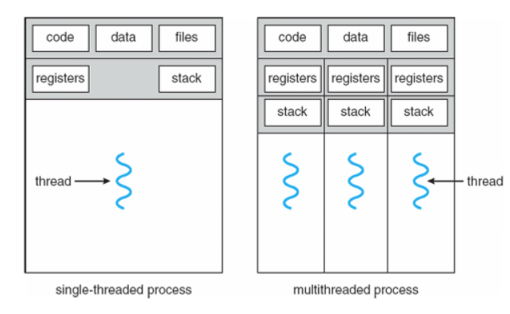
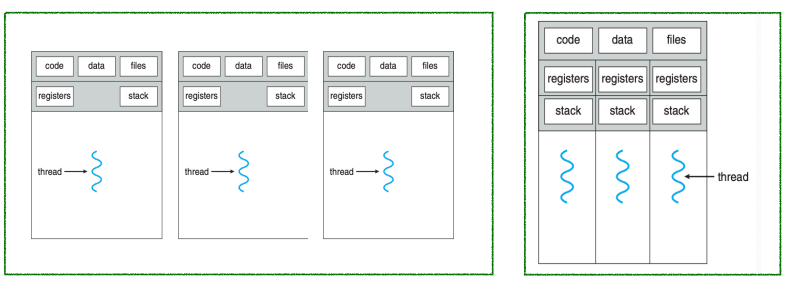

## 💻 쓰레드 

### 🎈쓰레드
프로세스가 실행되는 흐름의 단위다.\
프로세스는 적어도 하나의 스레드를 갖고 있다. 우리가 흔히 아는 main 함수가 스레드다.

### 🎈멀티 프로세스와 멀티 스레드의 차이
멀티 프로세스와 멀티 스레드는, 흐름이 동시에 진행된다는 것에서 공통점을 갖는다.
하지만, 프로세스와 다르게 멀티 스레드는 `메모리를 공유`한다는 점이다.

스레드마다 독립적으로 stack을 가지고 있다.

왼쪽이 멀티 프로세스고, 오른쪽이 멀티 스레드다.

### 🎈멀티 스레드 장점
멀티 프로세스보다 멀티 스레드를 사용하면 아래와 같은 장점들이 있다.
1. 응답성(responsiveness)\
2. 자원 공유(resource sharing)\
3. 경제성(economy)\
4. 구모 적응성(scalability)
