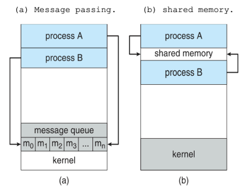

## 💻 프로세스 

### 🎈서론
운영체제은 여러개의 프로그램을 실행한다. cpu의 모든 활동들은 어떻게 부를까?
* 배치(batch) 서비스 : job을 실행
* 시분할 시스템(Time sharing): user program, task 실행  
등등...

이런 모든 활동은 유사하다. 그래서 현대적인 용어로 `프로세스`라 부른다. 용어가 대체되었다 생각!\
운영체제에서 프로세스는 하나의 작업단위(Task)다.

프로그램들은 `Secondary Memory`(보조 기억 장치)에 저장되어 있다. 
이 프로그램을 사용자가 실행하면? 해당 프로그램의 명령어 및 데이터를 `Main Memory`에 올린다.

**Why?**  
cpu는 Main Memory에만 직접적으로 접근할 수 있기 때문이다. 그리고, 모든 프로그램은 실행하려면 리소스가 필요하다. cpu가 필요해!

### 🎈프로세스란?
이렇게 Main Memory에 올려진 `실행중인` 프로그램을 ***프로세스*** 라 한다.\
Main Memory에 올려진 프로그램이 여러개의 프로세스가 될 수 있다. 수 많은 요소들로 구성된 개체로도 생각할 수 있다.

프로세스의 두 필수적이 요소는 `프로그램 코드`와 그 코드와 관련된 `데이터들의 집합`이다.

프로세서(cpu)가 프로그램 코드를 수행한다고 가정하면, 그 수행중인 개체가 `프로세스`인 것이다.

>### 프로세스의 종류
>* foreground process  
  사용자가 볼 수 있는 공간에서 실행되는 프로세스
>* background process(= daemon = service)  
  백그라운드에서 실행되는 프로세스\
  사용자와 상호작용하지 않음

### 🎈프로세스의 메모리 구조
여러 개의 프로세스들은 각자의 메모리 구조를 갖는다. 

* Stack : 함수를 호출할 때 임시 데이터 저장소(함수 매개변수, 복귀주소 및 지역변수)
* Data : 프로그램이 실행될 때 생성됨. 전역 변수, 정적변수, 배열, 구조체 등이 저장. 프로그램 끝나면 다시 시스템에게 반환.
* Text = Code : cpu가 실행할 코드 자체(명령어)가 저장됨
* Heap : c의 malloc과 같은 동적으로 할당되는 메모리

### 🎈프로세스 상태
프로세스가 실행되면 그 상태는 변한다. `프로세스의 상태`는 프로세스의 현재 활동에 따라 정의된다.
* new : 새로운 프로세스가 생성. 아직 메모리에 로드안됨
* running : 프로세스의 명령어들이 실행되고 있다.
* waiting : 각 입출력 장치마다 있는 'wait queue'에서 어떤 이벤트가 일어나기를 기다린다. 인터럽트가 발생되면 다시 ready 상태가 된다.
* ready : 'ready queue'에서 기다리면서 자신이 실행될(cpu에 할당될) 차례를 기다린다. 메모리에 적재된 상태
* terminated: 프로세스가 종료되었다.
 

### 🎈PCB
Process Control Block

운영체제는 프로그램을 Main Memory의 적당한 위치에 로드시킨다. 그게 프로세스임. 그리고 cpu는 Main Memory에 로드된 `프로세스`들을 관리한다. cpu가 프로세스를 관리하기 위해서 각자의 프로세스에 대한 정보가 있어야한다. PCB에 저장한다.

하나의 프로세스가 생성되면, 해당 프로세스의 고유 PCB가 만들어지고, 해당 프로세스가 종료되면 함께 사라진다.
(PCB가 없으면 프로그램이 프로세스로 전환되지 못한다. PCB에는 프로세스 실행에 필요한 여러가지 정보가 담겨있기 때문.) 

> "프로세스는 요리를 만드는 과정이고, PCB는 요리를 만들 때 고려할 사항들을 적어 놓은 주문서라고 볼 수 있다."
> 프로세스 = 프로그램 + PCB
> 프로그램 = 프로세스 - PCB
> 즉, 프로그램이 운영체제에게 PCB를 받아 프로세스로 전환된다.

PCB에는 어떤 내용이?

### 🎈PCB 구조
 
* 포인터 : 프로세스가 위치한 메모리 포인터.(프로세스가 현재 위치한 주소). ready queue와 wait queue를 구현할 때 포인터를 사용한다.
* 프로세스 상태: 생성, 준비, 실행, 대기, 보류 등 현재 프로세스의 상태를 나타낸다.
* PID : 프로세스 아이디
* PC : 해당 프로세스가 다음에 실행할 메인 메모리 상의 명령어 주소를 담고있다.
* CPU의 각종 레지스터들 : PC와 함께 여러가지 레지스터 값들을 저장한다. 나중에 프로세스가 다시 스케줄 될 때 계속 올바르게 이어서 실행되도록 인터럽트 발생 시 저장되어야한다. 
* 스케쥴링 정보 : 프로세스 우선순위, 큐 포인터를 저장
* 메모리 관리 정보 : 해당 프로세스가 main memory의 어느 영역에 위치해 있는지 저장. Base 
* 회계(Accounting)정보 : cpu 사용시간과 경과된 실시간, 시간 제한, 계정 번호, 잡 또는 프로세스 번호 등을 포함한다.
* 부모 PID, 자식 PID : 프로세스는 부모, 자식 관계를 가질 수 있다. 부모/자식 프로세스의 포인터가 담긴다.

PCB에는 프로세스의 중요한 정보를 포함하고 있다. 그래서 일반 사용자가 접근하지 못하도록 커널영역에 저장되어있다.

### 🎈Context Switching(문맥교환)
cpu를 사용하던 프로세스가 나가고 새로운 프로세스가 cpu를 점유하는 작업을 말한다.

이때 두 프로세스의 PCB정보가 변경된다.

'running' 상태에서 갑자기 인터럽트에 의해 cpu를 나가게 된 프로세스의 PCB는 지금까지의 작업 정보를 저장하고, running 상태'로' cpu에 들어오게된 프로세스의 PCB 내용으로 cpu의 내용이 다시 세팅된다.

이렇게 두 개의 프로세스의 PCB를 교환해서 cpu 값을 채우는 작업을 문맥 교환이라 한다.

어떤 순서로 프로세스가 처리되나? 스케줄러가 그 순서를 결정한다.

### 🎈스케줄러
*** 스케줄러란?
어떤 프로세스에게 자원을 할당할지를 결정하는 운영체제 커널의 코드를 의미한다.

#### 스케줄러 종류
* long-term scheduler\
    : 작업 스케줄러
    : Main Memory와 디스크(Secondary Memory) 사이의 스케줄링을 담당한다. 디스크에 저장된 어떤 프로그램을 가져와 커널에 등록할지 결정한다. Ready Queue에 삽입한다.\
    : new → ready
    : 참고로.. 현대의 time sharing 시스템에서 사용하는 os는 long-temr scheduler를 두지 않음. 요즘은 얘 없이 바로 메로리에 정재(ready)된다.
* short-term scheduler\
    : cpu 스케줄러
    : cpu와 메모리 사이의 스케줄링을 담당한다.
    : ready 상태의 프로세스 중 어떤 프로세스를 다음 순서로 실행할것인지 결정한다.
    : 미리 정한 스케줄링 알고리즘에 따라 cpu를 할당할 프로세스를 선택한다.
    : ms 이하의 시간 단위로 매우 빈번하게 호출되어서 수행 속도가 충분히 빨라야 한다.
    : ready → running → waiting → ready 

프로세스를 스케줄링하기 위해서 아래의 3가지 Queue가 존재한다.

#### Queue 종류
* job queue\
    : long-term scheduler가 job queue의 순서를 정해준다.
    : 모든 프로세스들이 존재. 
    : Secondary Memory(보조기억장치)에 있는 프로세스가 메모리로 load 될 때 보조 기억 장치에 형성되어있는 큐다.
* ready queue\
    : short-term scheduler가 ready queue 순서를 정ㄹ해준다.
    : cpu에 할당 받기 위해 프로세스 대기. Memory에 있다.
* device queue : Device Controller에 있는 큐다. running 중이었던 프로세스가 인터럽트에 의해 cpu 점유권을 잃을 때 device queue로 들어간다.

### 🎈프로세스 생성
프로세스가 실생되는 동안 프로세스는 여러 개의 새로운 프로세스들을 생성할 수 있다.
> 생성하는 프로세스 = 부모 프로세서
> 생성된 프로세스 = 자식 프로세서

부모-자식 프로세스는 `트리` 형태로 되어있다. 각각의 프로세스는 pid를 가지고 있다.

어떻게 자식 프로세스를 생성할 수 있을까?
시스템 콜을 사용한다.

Unix 운영체제 기준

* fork()\
: 시스템 콜 fork()를 이용한다.\
: 자식 프로세스는 부모의 메모리 공간의 복사본으로 구성된다. (부모-자식 프로세스간 더 쉬운 통신을 위해서다)
* exec()\
: 자신의 메모리 공간을 새로운 프로그램으로 교체한다.\
: 프로그램을 메모리로 load하고 실행한다.
* wait()\
: 부모 프로세스는 자식이 실행하는 동안 할 일이 없으면, 자식이 종료될 때까지 ready queue에서 기다린다.

### 🎈IPC
프로세스가 실행될 때, 다른 프로세스와 데이터를 공유하는 `협력적인` 프로세스와 공유하지 않는 `독립적인` 프로세스가 있다.

### `협력`을 하는 이유
* 정보공유\
* 계산 가속화(computation speedup)\
: 특정 태스크를 빠르게 실행하고자 한다. 서브 태스크로 여러 개를 나누어 병렬적으로 실행한다. (여러개 코어가 있는 경우만 ㄱㄴ)
* 모듈성(modulartiy)\
: 모듈 형식으로 시스템을 구성할 수 있다.

프로세스끼리 협력을 하기 위해서 `IPC` 기법이 필요하다. 

IPC에는 두 가지 모델이 있다.\

#### IPC 모델
1. 공유 메모리(shared memory)\
: 공유 메모리를 통해 서로 데이터를 교환할 수 있다.
2. 메시지 전달(message passing)
: `협력적인` 프로세스들 사이에 메시지가 교환되면서 통신이 이루어진다.

### 🎈프로세스 정의
프로세스를 아래와 같이 정의할 수 있다.

* cpu에 의해서 현재 실행되고 있는 프로그램
* cpu가 할당되는 실체
운영체제가 관리하는 최소 단위의 작업(프로그램)
* PCB를 지닌 프로그램
* Main Memory 혹은 Virtual Memory에 저장된 프로그램
* 프로세서가 할당되는 실체적인 개체로서, Dispatch가 가능한 단위다.
* Procedure가 활동 중인 상태
* 실행 중인 프로시저의 제어 단위
비동기적 행위를 일으키는 주체.
