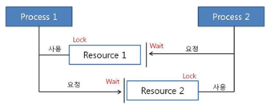

# 💻데드락

### 🎈 데드락이란?

운영체제에서 데드락이란, 시스템 자원에 대한 요구가 뒤엉킨 상태이다.

둘 이상의 프로세스가 다른 프로세스가 점유하고 있는 자원을 서로 기다릴 때 `무한 대기에 빠지는 상황`을 일걷습니다.

> 
* t1 : 프로세스1이 자원1을 얻음 / 프로세스2가 자원2를 얻음
* t2 : 프로세스1은 자원2를 기다림 / 프로세스2는 자원1을 기다림

### 🎈 데드락 발생하는 경우
멀티 프로그래밍 환경에서 한정된 자원을 얻기 위해 서로 경쟁하는 상황 발생.\
한 프로세스가 자원을 요청했ㅇ르 때, 동시에 그 자원을 사용할 수 없는 상왕이 발생할 수 있다. 이때 프로세스는 대기 상태로 들어간다.\
대기 상태로 들어간 프로세스들이 실행 상태로 변경될 수 없을 때 '교착상태'발생

### 🎈 데드락 발생 조건
아래의 4가지 조건이 모두 성립해야 데드락이 발생한다.\
(하나라도 성립하지 않다면? 데드락 문제 해결 가능!)

1. 상호배제(mutual exclusion)\
한번에 프로세스 하나만 자원을 사용할 수 있다. 사용중인 자원을 다른 프로세스가 사용하려면 요청한 자원이 해제될 때까지 기다려야함
2. 점유대기(hold and wait)\
자원을 최소한 하나 보유하고, 다른 프로세스에 할당된 자원을 점유하기 위해 대기하는 프로세스가 존재한다.
3. 비선점(no preemption)\
이미 할당된 자원을 강제로 뺏을 수 없다.
4. 순환대기(circular wait)\
대기중인 프로세스의 집합이 순환형태로 자원을 대기하고 있어야한다.

### 🎈 데드락 해결방법
데드락 해경법은 크게 3가지로 분류할 수 있다.

1. 데드락이 발생하지 않도록 `예방하기`
2. 데드락 발생 가능성을 인정하면서도 적절하게 `회피하기`
3. 데드락 발생을 허용하지만 데드락을 탐지하여, 데드락에서 `회복하기`

### 🎈 예방하기
데드락 발생 조건 4가지 중 하나라도 발생하지 않게 하는 것이 예방하는 방법이다.\
즉, 각각의 조건을 방지(부정)해서 데드락 발생 가능성을 차단한다.
* 상호배제 조건 방지 : 한번에 여러 프로세스가 공유자원을 사용할 수 있게한다. but, 추후에 동기화 관련 문제 발생
* 점유 대기 조건 방지: 프로세스 실행에 필요한 모든 자원을 한꺼번에 요구하고 허용할 때까지 작업을 보류해서, 나중에 또 다른 자원을 점유하기 위한 대기 조건을 성립하지 않도록 한다.
* 비선점 조건 방지 : 이미 다른 프로세스에게 할당된 자원이 선점권이 없다고 가정할 때, 높은 우선순위의 프로세스가 해당 자원을 선점할 수 있도록 한다.
* 순환대기 조건방지 : 자원을 순환 형태로 대기하지 않도록 일정한 한 쪽 방향으로만 자원을 요구할 수 있도록 한다.

단점: 시스템의 처리량이나 효율성을 떨어뜨림

### 🎈 회피하기
데드락 회피법에서는 safe sequence, safe state 등이 키워드다.

시스템의 프로세스들이 요청하는 모든 자원을 데드락을 발생시키지 않으면서 차례로 모두에게 할당해줄 수 있다면 safe state(안정상태)에 있다고 말한다.

드리고 이처럼 특정한 순서로 프로세스들에게 자원ㅇ르 할당, 실행 및 종료 등의 작업을 할 때 데드락이 발생하지 않는 순서를 찾을 수 있다면, 그것을 safe sequence(안전 순서)리 부른다.

반면, 불안정 상태는 "데드락 발생 가능성이 있는 상황"이며, 데드락은 불안정 상태일 때 발생할 수 있다.

회피하기 위한 알고리즘 중 유명한 알고리즘 `은행원 알고리즘(banker's algorithm)`이 있다.

***은행원 알고리즘***

### 🎈 탐지 및 회복하기
