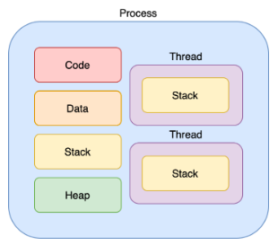
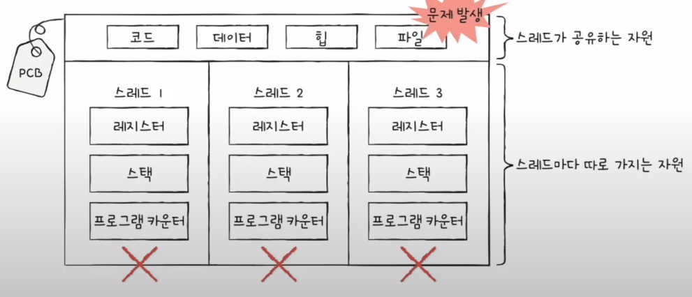

# ✨복습

### 쓰레드란?
프로세스 내에서 실행되는 흐름의 단위 또는 cpu 스케쥴링의 기본단위이다.\
쓰레드는 각자의 stack을 가지고 있으며, 자기가 존재하고 있는 프로세스의 Data, Heap, Code 영역을 공유하고 있다.

하나의 프로세스에, 여러개의 쓰레드가 존재할 수 있으며, 쓰레드는 프로세스의 Code, Data, Heap을 공유하기 때문에 통신이 간단하며 메모리 낭비가 적다.

***쓰레드가 독립적으로 가지고 있는 부분***
>
- Program Counter
- register set
- stack space

***쓰레드가 동료 쓰레드와 공유하는 부분(=task)***
- code section
- data section
- os resource

### 프로세스와 쓰레드의 차이
프로세스는... \
메모리 영역을 `운영체제에게 할당받음`.\
프로세스 간 통신할 때 IPC 필요.
각자 Stack, Heap, Code, Data 영역을 가진다.\
하나의 프로세스는 한개 이상의 쓰레드를 가진다.\
프로세스 생성, context switching에 많은 비용이 들어간다.

쓰레드는..\
프로세스가 할당받은 자원을 쓴다^^\
각자 Stack을 가진다.\
프로세스 생성, context switching에 적은 비용이 들어간다.

### 멀티 프로세스, 멀티 쓰레드

***멀티 프로세스***
- 여러 개의 프로세스를 사용한다.
- 프로세스들은 각자의 독립된 Heap, Data, Code, Stack 영역을 가진다. (지들끼리 변수나 자료 등 공유X. 접근도 X)
- 여러 개의 프로세스가 각자의 task를 처리한다.
- context switching이 발생하면, 캐시에 존재하는 모든 데이터를 리셋하고, 다시 캐시 정보를 불어온다. => 오버헤드 큼
- 프로세스들이 통신을 하려면 복잡한 IPC를 사용해야한다. 
- 여러 자식 프로세스 중 하나에 문제가 발생하면, 문제가 발생한 해당 자식 프로세스에만 이상이 생기고 나머지 프로세스에게 영향을 주지 않음

***멀티 쓰레드***
- 여러 개의 쓰레드가 하나의 task를 함께 처리한다.
- 프로세스를 생성하는 system call이 줄어 들어 자원을 효율적으로 관리할 수 있다.
- Througput(시스템 처리량)이 증가한다.
- concurrency와 parallelism을 얻을 수 있기 때문에 효율적이다.
- 프로세스의 Data, Heap, Code영역을 공유하기 때문에, 쓰레들 끼리 통신이 간단하다. 그리고 메모리 낭비도 적다
- 쓰레드간 자원을 공유하기 때문에, `동기화 문제`가 발생할 수 있다.
- 하나의 쓰레드에 문제가 생기면 전체 프로세스에 영향을 준다.

### 동기화 문제란? (Synchronization Issue)
멀티 쓰레드를 사용하면, 각각의 쓰레드 중 어떤 것이 어떤 순서로 실행될지 그 순서를 알 수 없다.\
만약, A 쓰레드가 어떤 자원을 사용하다가 B 쓰레드로 제어권이 넘어간 후 B 쓰레드가 해당 자원을 수정했ㅇ르 때, 다시 제어권을 받은 A 쓰레드가 해당 자원에 접근을 하지 못하거나, 바뀐 자원에 접근하게 되는 오류가 발생할 수 있다.

이처럼 `여러개의 쓰레드가 함께 전역변수를 사용할 경우` 발생할 수 있는 충돌을 동기화 문제라고 한다.\
쓰레드의 스케줄링은 운영체제가 자동으로 해주지 않음!!\
그래서 프로그래머가 적절한 기법을 직접 구현해야되므로, 프로그래밍할 때 멀티쓰레드를 사용하려면 신중해야한다.

