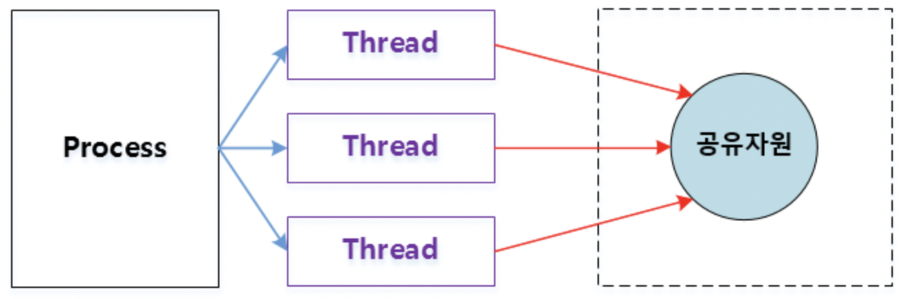
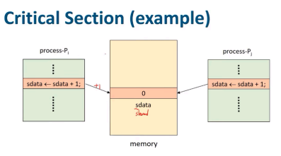
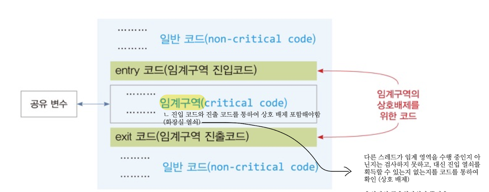
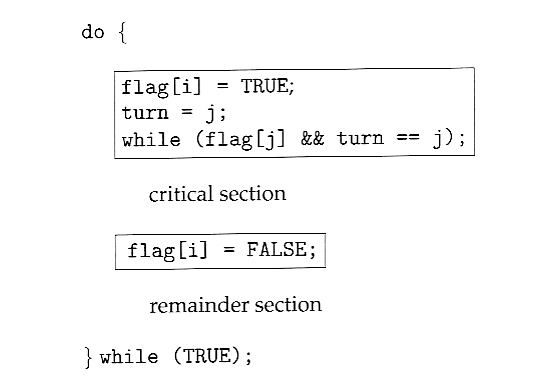
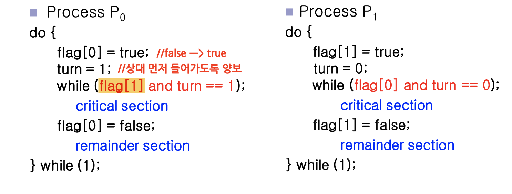
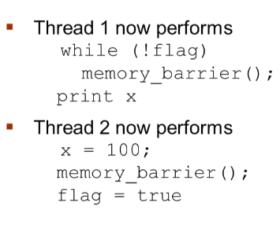
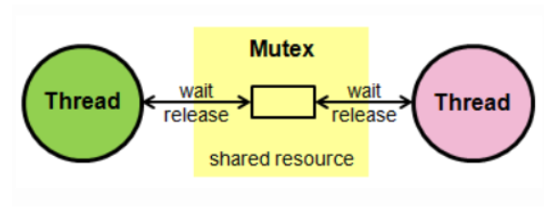
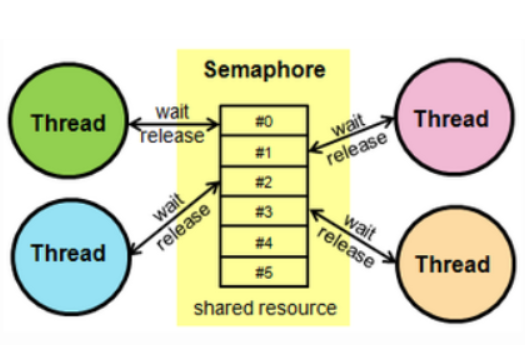
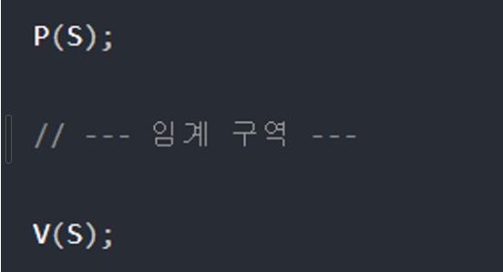

# 💻프로세스 동기화

`협력적 프로세스`는 시스템 내에서 실행중인 다른 프로세스의 실헹에 영향을 주고 받는 프로세스 이다.\
협력적 프로세스는 IPC를 통해 통신하고, 자원을 공유한다.

공유 자원을 동시에 접근하면, 데이터의 일관성이 망가질 수 있다. 
> 


예시를 들어보면,
> 공유 자원인 전역변수 `예금 10만원`이 있다고 가정하자.
> A 프로세스가 `예금 10만원`을 확인한 상황에서 B 프로세스가 `예금 15만원을 입금`하여 총 `25만원의 예금`이 저장된다.
> 하지만, A 프로세스가 확인했던 예금은 10만원이기 때문에 따로 10만원을 추가하더라고 15 + 10 = 25만원이 아니라, `10 + 10 = 20만원` 이라는 총 예금이 저장되게 된다.

이렇게 정확하지 않은 상태는,, 두 개의 프로세스가 동시에 `예금 변수`를 조작하도록 허용했기 때문이다.

이렇게 동시에 여러 개의 프로세스가 동일한 데이터에 접근하고, 조작하여 그 실행 결과가 접근이 발생한 특정 순서에 의존하는 상황을 `경쟁 조건(race condition)`이라고 한다.

이런 race condition으로부터 보호하기 위해, 한 순간에 하나의 프로세스만이 예금 변수를 조작할 수 있도록 보장해야한다. 그리고 프로세스들이 동기화되도록 해야한다.


***정리***
* 공유 자원\
    여러 프로세스가 공동으로 이용하는 변수, 메모리, 파일 등을 말한다.\
    공동으로 이용되기 때문에 누가, 언제 데이터를 읽거나 쓰느냐에 따라 그 결과가 달라진다.
* 경쟁 조건(race condition)
    2개 이상의 프로세스가 공유 자원을 병행적으로 읽거나 쓰는 상황\
    경쟁 조건이 발생하면 공유 자원 접근 순서에 따라 실행 결과가 달라진다.


### 🎈 프로세스 동기화가 필요한 이유


***프로세스 동기화***\
여러 프로세스가 공유하는 자원의 일관성을 유지하는 것

여러 프로세스가 서로 협력해 공유 자원을 사용하는 상황에서 경쟁조건이 발생하면, 공유자원의 신뢰성이 떨어진다. 이를 방지하기 위해 프로세스들이 공유 자원을 사용할 때 특별한 규칙을 만들어야한다.

### 🎈 임계구역(Critical Section)

경쟁조건(race condition) 때문에, 프로세스들이 동시 접근할 때 접근 순서에 따라 실행결과가 달라지고, 데이터의 일관성도 해치게 된다.

이런 race condition이 발생하는 곳을 `임계구역(Critical Section)`이라 한다.
> 쉽게 말해 '공유자원을 수정하는' 영역?!
> 
```cpp
#include <iostream>
#include <thread>
#include <mutex>

int shared = 0; // 공유자원

int main(){
    bool flag = false;
    while(!flag){
        shared++;
        shared += 10;
        if(shared == 5) flag = true;
    }
}
```


### 🎈 임계구역(Critical Section) 문제 해결 조건
임계구역에서 발생하는 문제를 해결할 수 있는 방안은 다음의 세 가지 조건을 충족해야한다.
* 상호배제(mutual exclusion)\
하나의  프로세스/쓰레드가 임계구역(Critical Section)에 들어가 있으면 다른 프로세스는 들어갈 수 없다.\
→ 배타적/독점 사용!\
→ 먼저 임계구역(critical section)에 진입한 애가 실행이 끝날때까지 기다림\
→ context switching이 일어나도 임계 구역에는 한 쓰레드/프로세스만 진입 ㄱㄴ
> 
> T1이 임계 구역 코드를 실행하고 있는 동안 T2가 대기 → 상호배제 성공!
> 일반코드(non-critical code) : 공유 자원에 접근하지 안는 코드
> 임계구역 진입 코드(entry code) : 상호 배제를 위한 처리 수행. 현재 프로세스/쓰레드만이 임계 영역을 수행할 수 있도록 처리함
>  임계영역 진출 코드(exit code) : 상호 배제를 위한 처리 수행. 다른 프로세스/쓰레드가 임계 영역에 진입할 수 있도록 처림
* 한정대기(bounded waiting)\
상호배제(mutual exclusion)때문에 기다리게 되는 프로세스가 무한 대기하지 않아야 한다. 즉, 특정 프로세스가 임계 구역에 진입하지 못하면 안된다.\
→ 임계구역 진입 횟수에 한계를 걸어놓고, 프로세스가 계속해서 독점해서 사용하지 못하게 한다.
* 진행의 융통성(progress flexibility, progress)\
임계구역에 프로세스가 없다면 어떠한 프로세스라도 들어가서 자원을 활용할 수 있다. 

### 🎈 임계구역 문제를 해결하는 방안(동기화 방법)
임계구역에서 발생하는 문제는 아래의 세가지를 통해 해결할 수 있다.
* 소프트웨어 기반 해결법\
→ Peterson's Solution
* 하드웨어 기반 해결법
* 상위 수준 소프트웨어 도구

### 🎈 피터슨의 알고리즘(Peterson's Solution)
임계구역 문제를 `소프트웨어적으로 해결`는 방법이다.

`turn`과 `flag`라는 변수로 임계구역(critical section)에 들어갈 프로세스/쓰레드를 결정한다.
→ 두 프로세스가 두 개의 데이터 항목을 공유하며 해결한다.
> * `int turn` : 임계구역으로 진입할 프로세스의 순번(turn = i이면, Pi가 임계구역을 실행한다.)
> * `bool flag[2]` : 특정 프로세스가 임계구역으로 들어갈 준비가 되었다는 것을 타나낸다.(flag[i] = true이면, 프로세스 Pi가 임계구역으로 들어갈 준비가 되었다는 것)
>
> → 프로세스 Pi가 임계 구역으로 진입하기 위해 `flag[i] = true`로 해놓고, turn을 j로 지정한다. 프로세스 Pj가 임계구역으로 진입하기 원한다면 진입가능하다는 것을 보장함.\
> → 임계구역으로 진입하기 전 flag[j]가 true인지 확인하고(Pj가 임계구역에 진입해 있는지 확인) 그렇다면 무한루프, 아니라면 무한루프를 빠져나와 critical section으로 진입한다.
>
> 프로세스 P0와 P1이 있다.
> ***P0***
> → 먼저, P0는 flag를 true로, turn은 1로 설정한다.\
> → flag[1] == true && turn == 1이면 P0는 무한루프를 돈다(=> P1의 실행이 끝날때까지 P0가 무한 루프를 돌면서 기다린다는 의미!)\
> → P1의 임계구역(critical section) 실행이 끝나면, P0는 while의 무한루프를 빠져 나와, 임계구역을 실행한다.\
> → 임계구역 실행이 끝나면 flag[0] = false 해줍니다
> ***P1***
> → 먼저, P1는 flag를 true로, turn은 0로 설정한다.\
> → flag[0] == true && turn == 0이면 P0는 무한루프를 돈다(=> P0의 임계구역 실행이 끝날때까지 P1가 무한 루프를 돌면서 기다린다는 의미!)\
> → P0의 임계구역(critical section) 실행이 끝나면, P1는 while의 무한루프를 빠져 나와, 임계구역을 실행한다.\
> → 임계구역 실행이 끝나면 flag[1] = false 해줍니다

### 🎈 피터슨 알고리즘이 '임계구역 문제 해결 조건'에 부합하는가?
1. 상호배제(mutual exclusion) 부합🍀\
P0과 P1이 동시에 임계 영역에 들어간다는 것은 우선 flag[0] = flag[1] = true여야한다. turn은 int니깐 0과 1 중 한개의 값만 가질 수 있다. 따라서, P0과 P1은 동시에 임계 영역에 진입해 실행할 수 없다. 
2. 진행의 융통성(progress) 부합🍀\
임계구역을 이용하는 프로세스가 없을 때, 어떤 프로세스라도 지체없이 임계구역에 접근할 수 있나?\
각 프로세스에 대해 초기 flag는 false를 가지고 있다가 임계구역을 실행하고 싶을때 피터슨 솔루션에 접근하여 flag를 true로 가진다.\
P0이 임계구역(critical section)에 들어갈 준비가 되지 않았으면 flag[0] = false다. 즉, P1이 임계 역역에 들어갈 수 있는 상황인 거다.\
P0이 while문에서 P1의 임계구역 실행이 끝날 때까지 기다리고 있을 때, turn 값은 0이거나 1이다. 만약 turn이 1이면, P1이 임계 영역에 들어갈 수 있으며, turn이 0이면 P0이 임계 영역에 들어가게 된다.
3. 한정대기(bounded waiting) 부합🍀\
어떠한 프로세스도 무한히 대기하는 기아상태(starvation)에 빠지면 안된다.\
프로세스가 2개인 피터슨 솔루션에서는 한쪽이 대기를 하고 있다면 다른 한쪽이 임계영역을 작업한 후 flag가 false가 되는 순간 대기하던 프로세스가 바로 무한 루프를 빠져나와서 임계 구역으로 진입해 실행하기 때문에 기아상태(starvation)은 발생하지 않음

`+) progress와 bounded waiting이 부합한지 체크`\
 우리는 프로세스 P0가 임계 구역에 진입 못 하도록 막는 방법은 그것을 while 문에(flag[1] == true && turn == 1) 조건으로 묶어두어 계속 공회전하도록 만드는 방법이라는 사실에 주목하여야 합니다. 이 while loop가 유일한 방법이기 때문입니다. P1가 임계 구역에 들어갈 준비가 되지 않았을 경우에는 (flag[1] == false)이고 P0는 임계 구역에 진입할 수 있습니다. P1가 flag[1]를 true로 지정하고 역시 자신의 while 문을 수행하게 되면 이때 turn == 0 이든지 turn == 1일 것입니다. turn == 0 라면 P0가 임계 구역에 진입하게 되고 turn == 1라면 P1가 임계 구역에 진입하게 됩니다. 그러나 추후 P1가 임계 구역을 빠져나올 때는 P1가 flag[1]를 false로 재지정하여 P0로 하여금 임계 구역에 진입하게 만들어 줍니다. P1가 flag[1]를 true로 재지정하고 나면 반드시 turn 값도 0로 지정해주어야 합니다. P0는 while 문을 수행하는 동안 turn 값을 바꾸지 않기 때문에 P0는 P1가 지난번에 진입했다면 이번에는 자기도 한 번은`(따라서 대기 시간이 한없이 길어지지 않음)` 들어갈 수 있게`(progess 보장)` 됩니다.


### 🎈 피터슨 알고리즘의 문제 
❗ 피터슨 솔루션은 `프로세스가 최대 2개인 경우`만 고려한 것이다. 그래서 프로세스가 3개 이상인 경우에는 사용할 수 없다.

❗ 현대 컴퓨터 아키텍쳐에서는 보장된 작동을 하지 않을 수 있다.

### 🎈 Memory Barriers, test_and_set & compare_and_swap
`하드웨어적으로` 임계구역(critical section) 문제를 해결하는 방법이다.

컴퓨터 아키텍처가 응용 프로그램에게 메모리를 어떻게 제공하느냐에 따라 '메모리 모델'이 달라진다.

1. 강한 순서(strongly ordered)\
한 프로세서의 메모리 변경 결과가 다른 모든 프로세서에 즉시 보인다.
2. 약한 순서(weakly ordered)\
한 프로세서의 메모리 변경 결과가 다른 프로세서에 즉시 보이지 않는다.

메모리 모델은 프로세서 유형에 따라 다르므로, 커널 개발 시 가정할 수 없다.

이를 해결하기 위해 컴퓨터 아키텍처는 `메모리의 모든 변경사항을 다른 모든 프로세서로 전파하는 명령어를 제공`하여 다른 프로세서에서 실행중인 쓰레드에 메모리 변경사항이 보이는 것을 보장한다.

이러한 명령어를 메모리 장벽(memory barrier) 또는 메모리 펜스(memory fence)라고 한다.

***메모리 장벽(memory barrier)***
메모리 장벽 명령어가 실행될 때, 시스템은 다음 명령어가 실행되기 전에 모든 적재나 저장이 완료되도록 한다. 만약 명령어가 재배치되더라도, 이후 명령 실행 전에 저장이 완료되고 그 결과가 모두에게 보인다.
> 
> 쓰레드1에서는 flag 값이 x보다 먼저 적재되도록 보장한다.
> 쓰레드2에서는 x값이 flag 값보다 먼저 배정되도록 보장한다.

메모리 장벽을 통해 peterson의 해결방법의 재배치 문제를 해결할 수 있다.

***test_and_set() & compare_and_swap()***

하드웨어 명령어는 데이터 접근 → 연산 → 연산 결과 저장 과정을 한번에 수행할 수 있도록 하드웨어적인 지원을 해주는 것이다.\
한번에 수행하는 것을 atomically(원자적으로)하게 수행한다고 표현하는데, 원자적으로 수행한다는 것은 인터럽트 되지 않고 수행된다는 것이다.

***test_and_set(lock)***
```python
def test_and_set(lock):
	tmp = lock

	lock = True

	return tmp
```
* test_and_set(lock) 명령어는 lock의 값을 읽고(복사 후 반환), lock을 True로 설정하는 일을 한번에(원자적으로) 수행한다.
```python
while test_and_set(lock) :
	#wait
	continue

#critical section

#lock 해제
lock = False
```
> - 만약, lock이 true였다면, test_and_set은 lock을 True로 설정하고, True를 반활할 것이므로 반복문에서 돌게 된다.
> - 만약 lcok이 false였다면, test_and_set은 lock을 true로 설정지만, false를 반환하므로 반목문에서 빠져 나와 crictical section을 수행한다. 수행이 끝나면 다시 lock을 fals로 설정한다.

***compare_and_swap()***
```python
def compare_and_swap(value, expected, new_value):
	tmp = value

	if value == expected :
		value = new_value

	return tmp
```
* value값을 읽고(복사 후 반환), value가 expected와 같다면, value의 값을 new_value로 설정하는 일을 한번에 수행한다.
```python
while compare_and_swap(lock, False, True) : 
	#wait
	continue

#ciritical section

#lock 해제
lock = False
```
* 만약 lock이 True였다면, compare_and_swap은 lock을 True를 반환하여 반복문에서 돌게된다.
* 만약 lock이 False였다면, compare_and_swap은expected 값인 False와 같기 때문에 lock을 True로 설정하지만, False를 반환하기 때문에 반복문에서 빠져나와 critical section을 수행한다. 수행이 끝나면 다시 lock을 False로 설정한다.

### 🎈 Mutex Locks, Semaphores
`상위 수준 소프트웨어 도구`로 임계구역(criticcal section) 문제를 해결하는 방법이다.


***mutex***
공유자원 및 임계구역에 하나의 프로세스/쓰레드가 접근하는 것을 막아준다.

동기화 대상이 하나다.

* 임계구역을 가진 쓰레드의 `실행시간(Running Time)이 서로 겹치지 않고` 각각 단독으로 실행(=> 상호배제 mutual exclusion)되도록 하는 기술이다.
* 한 프로세스에 의해 소유될 수 있는 `key를 기반(key는 뮤텍스 객체라 생각!)`으로 한 상호배제 기법\
(key에 해당하는 어떤 객체가 있으며, 이 객체를 소유한 쓰레드/프로세스만이 공유자원에 접근할 수 있따.)
* 다중 프로세스들의 공유 리소스에 대한 접근을 조율하기 위해 `동기화(synchronization) 또는 락(lcok)`을 사용함으로써 뮤텍스 객체를 두 쓰레드가 동시에 사용할 수 없다.
> 

***Semaphore***
공유자원 및 임계구역에 여러개의 프로세스/쓰레드가 접근하는 것을 막아준다.

동기화 대상이 하나이상이다.

자원을 사용하고 있는 프로세스/쓰레드 수를 공통으로 관리하는 하나의 값을 이용해 상호배제(mutual exclusion)에 달성한다.

공유자원에 접근할 수 있는 프로세스의 최대 허용치만큼 동시에 사용자가 접근할 수 있으며, 각 프로세스는 세마포어 값을 확인하고 변경할 수 있다.

자원을 사용하지 않ㄴ는 상태가 될 때, 대기하던 프로세스가 즉시 자원을 사용하고, 이미 다른 프로세스에 의해 사용중이라는 사실을 알게 되면, 재시도 전에 일정시간 대기해야한다.

> 

* 예) 세마포어 값이 3이고, 공유자원을 쓰려는 프로세스가 5개다. 먼저 프로세스 3개가 공유 자원을 사용하고(세마포어 0), 그 다음 프로세스는 세마포어가 양수가 될 때까지 기다린다. 

세마 포어 값은 정수 값을 가지며, p연산과 v연산을 통해 제어됩니다.

- 세마포어 값이 0이상이면 1을 감소, 0미만이면 호출한 스레드 또는 프로세스를 대기 상태로 전환
- 프로세스 진입 여부를 자원의 개수로 결정
- V
    - critical section(임계구역)에서 나올 때 수행
    - 세마포어 값을 증가시키는 연산
    - 대기 중인 스레드 또는 프로세스가 있을 경우, 그 중 하나의 프로세스를 깨워서 1증가킨다.
    - 자원 반납 알림, 대기 중인 프로세스를 깨우는 신호
> 

