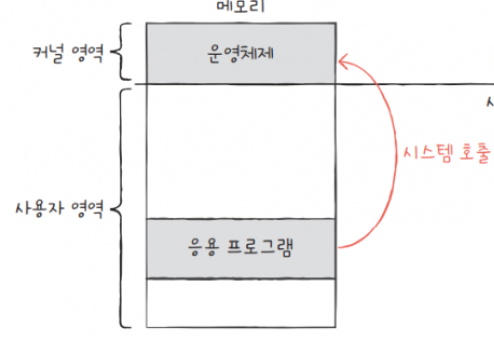
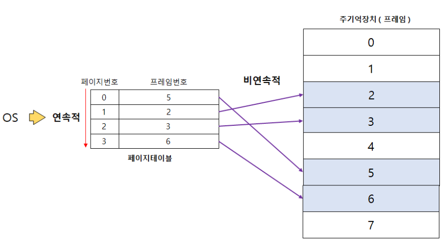
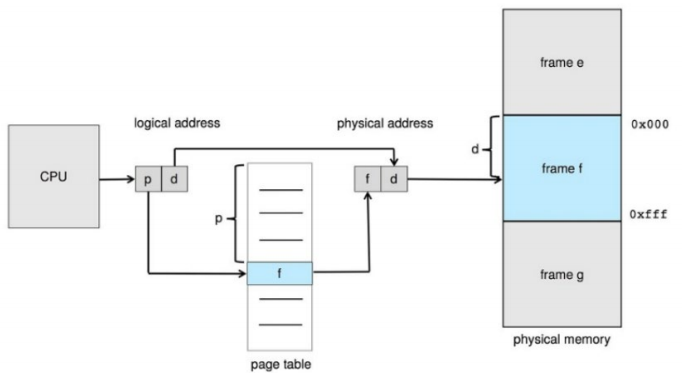

# 💻 Main Memory

### 🍀참고

프로세스는 실행중인 프로그램을 말한다.\
여기서 '실행중'이라는 말은 `Main Memory`에 올라갔다는 뜻임.\

***프로세스가 시스템에 들어오면***\
1. 입력큐에 넣고 
2. OS는 각 프로세스가 메모리를 얼마나 요구하는가 / 사용 가능한 메모리 공간이 어디에, 얼마나 있는지 고려한다.
3. 프로세스 공간 할당 받으면, 이후로는 cpu 할당을 받기 위해서 경쟁을 한다.
4. 프로세스가 끝나면, 메모리 반납
5. 운영체제는 입력 큐에 있는 다른 프로세스들을 메모리에 할당

### 🎈cpu의 main memory 접근

cpu 스케줄링 결과로 cpu 이용률과 사용자에 제공하는 컴퓨터 응답속도를 모두 향상할 수 있다.\
그러나, 이러한 성능 향상을 실현하려면 많은 프로세스를 메모리에 유지해야한다.

> 

`Main Memory`와 각 프로세서 코어에 내장된 레지스터들은 cpu가 직접 접근할 수 있는 유일한 범용 저장장치이다.\
그래서, 실행되는 명령어 및 데이터들은 cpu가 직접적으로 접근할 수 있는 Main Memory와 레지스터에 있어야한다.\
* 각 cpu 코어에 내장된 레지스터들은 일반적으로 cpu 클록의 1사이클 내에 접근 가능
* Main Memory의 접근을 완료하기 위해서는 많은 cpu 클록 틱 사이클이 소요된다.
    - 이 경우 cpu가 필요한 데이터가 없어서 명령어를 수행하지 못하고 지연되는 (stall) 현상 발생
    - 해결방안으로 메모리 접근을 줄이기 위해 빠른 속도의 메모리인 캐시를 추가한다. 

***연산-실행 순환 과정(Instruction-Execution Cycle)***
1. instruction이 메모리로부터 fetch된다.
2. 해당 instruction은 decode되어 다른 피연산자를 메모리로부터 fetch할 수도 있다.
3. 연산이 피연산자에 대해 실행되면, 결과는 다시 메모리에 저장(store)된다.

Memory 거대한 바이트의 배열이다. 각 바이트에는 주소(address)가 저장된다.\
cpu는 프로그램 카운터(PC, 다음 실행 명령어 주소가 저장됨)가 지정한 주소에서 명령을 가져와(fetch) 실행한다. 명령어에서 load나 store 메모리에 접근하는 연산을 수행할 수도 있다.

### 🎈 Memory 공간 보호

> 시스템이 올바르게 동작하기 위해서는 사용자 프로그램으로부터 운영체제 영역을 보호해야 할 뿐만 아니라 사용자 프로그램 사이도 보호해야 한다. 
> 
> 
> 

멀티 프로그래밍 및 멀티 프로세서 환경에서는 `각 프로세스가 자신들의 메모리 공간`을 독립적으로 사용하고 있다.(메모리 위에서 독립적인 공간을 사용!)\

특정 프로세스만 접근할 수 있는 `합법적인 메모리 주소 영역을 설정`한다. 프로세스가 합법적인 영역만을 접근하도록 하는 기능이 필요!

 각 프로세스는 할당된 메모리 주소에 base register(기준 레지스터, 합법적인 물리 메모리 주소(시작))와 limit register(상한 레지스터, 끝, 크기)로 프로세스의 주소공간을 결정할 수 있다.\

특정 메모리 주소에 접근하고자 할 때 그 주소가 `base와 limit 사이에 존재하는 주소일때만 접근가능`하다. 만약 잘못된 접근인 경우 `segmentation fault`가 일어나 프로그램이 중단됨!

### 🎈주소 할당(address binding)

`프로그램은 실행 가능한 binary 파일 형태로 disk에 존재한다`. 프로그램을 실행시키기위해서 프로그램을 메모리로 옮겨야한다. 메모리로 옮겨지기 전 프로세스들은 `input queue`에서 대기한다.

* input queue에서 프로세스 하나를 선택해서 메모리에 로드한다.
* 프로세스가 실행되면, 메모리의 연산과 데이터들을 접근한다.
* 프로세스가 종료되면, 프로세스가 사용하던 메모리영역을 해제하고 다시 사용가능해진다.

프로세스가 메인메모리에 저장될 때 `주소할당(address binding)`해야한다.

***address binding***

하나의 주소 공간에서 다른 주소 공간으로 매핑하는 과정을 말한다.

> 프로세스의 주소는 os커널에서 지정하기 때문에 0000000부터 시작하지 않음!

***주소 종류***
* Symbolic address\
변수나 함수와 같이 코드에서 사용하는 상징적인 이름을 주소로 사용하는 방법 => 프로그래머가 이해하기 쉽다.

* Physical address\
실제 gkemdnpdjtkd 물리적인 메모리 위치를 식별하는 주소\
absolute address 라고도 한다.

* Logical address\
프로세스마다 독립적으로 갖는 공간\
논리적인 주소 체계로, 0번지를 시작으로 상대적인 주소 값을 갖는다.\
CPU에서 인식하는 주소 체계이다. cpu가 생성하는 주소임\
virtual / relative / relocatable address 라고도 한다.

***논리적인 주소를 물리주소에 매핑하기 위해서는 논리적주소공간(ogical address space)와 물리적 주소 공간(physical address space)이 분리되어야 함!***

***주소 할당 순서***
1. 원시 프로그램(soure program)에서의 주소는 일반적으로 symboli address로 표현됨
2. 컴파일러는 이런 symbolic address를 재배치 가능한 reloatable address 주소로 바인딩한다.
3. 링커나 로더가 재배치 가능 주소를 절대 주소로 바인딩 시킨다.
> 

> 어느 타이밍에 주소 바인딩이 이루어지는지에 따라 `compile time / load time / run time address binding`으로 나뉜다.

❗ compile time, loadtime runtime address binding 더 자세히!

### 🎈MMU(Memory Management Unit)
MMU는 cpu가 메모리에 접근하는 것을 관리하는 컴퓨터 하드웨어 부품이다.\
cpu가 프로세스를 실행할 때 실제 사용하는 주소(논리주소)와 실제 주소 값(물리주소)가 다르기 때문에 `논리주소 -> 물리주소`로 변환해줘야한다.
논리 주소를 물리주소로 매핑하기 위한 장치임\

MMU는 cpu 안에 위치하며, cpu가 메인메로리에 접근하기 전에 MMU를 거쳐 논리주소를 물리주소로 바꿔 주소를 얻는다.

또한, MMU는 메모리 영역에 대한 접근을 제한해 메모리를 보호하는 역할을 한다.

>
> 
> MMU에는 재배치 레지스터(relocation register)가 존재하여 베이스 레지스터의 역할을 한다. cpu가 전다한 논리 주소를 규칙에 맞춰 물리 주소에 매핑함!

### 🎈 연속 메모리 할당(contiguous memory allocation)

> 

OS와 사용자 프로세스가 메모리를 사용할 수 있다. 여러 사용자 프로셋가 동시에 메모리에 있을 수 이써야 하기 때문에 사용 가능한 메모리를 어떻게 할당할 것인지 결정해야한다. 연속 메모리 할당은 메모리를 단일 구역(single section)에 할당하는 방식으로, 여러 곳에 나눠서 할당되어 있지 않고, 한 구역에 할당되어 있으므로 `연속적`이다.

이떄 메모리 보호는 재배치 레지스터(relocation register)오 한계 레지스터(limit register)를 통해 이루어짐. => 단일 구역(single section) 내에 접근할 수 있도록!
> 

각 프로세스의 크기가 제각각이기 때문에 어떤 프로세스를 어떻게 할당할 것인지가 중요해졌다~

연속 메모리 할당 기법은\
프로세스를 메모리에 올릴 때 프로세스의 주소공간을 메모리의 한 곳에 연속적으로 적재하는 방식이다(프로세스가 필요로 하는 데이터를 연속적으로 할당)\
연속 할당 방식에서는 물리적 메모리르 다수의 분할로 나누어 하나의 분할에 하나의 프로세스가 적재되도록한다.\

종류: 고정분할방식 / 가변분할방식

***고정분할방식***\
메모리를 여러개의 영역(고정된 크기 or 각기 다른 크기)으로 나눠서 거기에 프로세스를 할당한다.

> 
> 
> 사진처럼 프로세스의 할당 & 해제를 반복하다보면 빈 공간(hole)이 생긴다. => `단편화 fragmentation`
> 이 hole을 잘 관리하는 것도 하나의 이슈가 됨!

저장공간에 동적으로 메모리를 할당할 때 여러 구멍들 중에 크기 n만큼의 메모리를 어느 구멍에 할당할지에 대한 문제가 발생하였다.

***단편화(fragmentation)문제***\
* 외부 단편화(external fragmentation)\
: 메모리 공간이 조각조각 나눠져 있어서 프로세스를 메모리에 할당할 수 없음.\
: 예) 메모리에 할당할 수 있는 공간이 20MB인데 2MB씩 10개로 쪼개진 상태. 근데 프로세스가 3MB짜리여서 나누어진 2MB 공간에 할당할 수 없다
* 내부 단편화(internal fragmentation)\
: 빈 공간에 메모리를 할당하고보니, 그 공간이 또 남음. 근데 그 공간에 프로세스를 할당할 수 없는 상태다.

***가변 분할 방식***\
할당할 프로세스의 크기에 맞춰서 메모리에 할당한다.`relocate address`에서 프로세스가 들어갈 수 있는 메모리 공간을 찾는다!

3가지 해결방법)\
1. 최초 적합(first-fit): hole을 탐새가다가 할당할 수 있는 가장 첫번째 hole에 할당한다.(프로세스 크기 이상이라면 그냥 할당)
2. 최적적합(best-fit): 할당할 수 있는 hole들 중 가장 작은 hole에 할당(우선순위 큐로 구현 ㄱㄴ)
3. 최악적합(worst-fit): 할당할 수 있는 hole 중 가장 큰 hole에 할당하기

그래도 외부 단편화 external fragmentaion 문제가 발생하긴한다.

가변 분할 방식의 외부 단편화 문제를 해결하기 위해 `압축 compaction` 방법이 있다.

***압축 compaction***\
물리적 메모리 중에서 사용중인 메모리 공간을 한쪽으로 몰고 가용 공간을 확보하는 방법이다.\
메모리를 효율적으로 사용할 순 있지만, 수행중인 프로세스의 메모리 주소 공간을 이동시켜야 하므로 비용이 매우 많이 드는 방법이다.

### 🎈 비연속 메모리 할당
비연속 메모리 할당 방식이 실제 환경에서 사용되는 메모리 분할 방법이다!
`Paging`과 `Segmentaion` 방식이 있다.

***Paging***\
외부단편화를 방지하려는 기법으로,,,\
메모리를 고정된 크기의 파티션으로 나누고, 프로세스 또한 똑같은 고정된 크기의 조각으로 나눈다.

Paging의 기본적인 방법은 메모리를 동일한 크기로 쪼개는 것이다.

메모리를 나눈 파티션 => `Frame` (물리적 개념)
프로세스를 나눈 파티션 => `Page` (논리적 개념)

> page를 각각의 frame에 분산시켜 저장

논리주소공간과 물리주소공간이 완벽하게 분리되기 때문에 물리주소를 구려하지 않고 프로그래밍할 수 있다.

Paging 기법의 관건은 page를 어떻게 Frame과 맵핑하느냐이다.!

프로그램이 연속적으로 할당되었다면 상대 주소만 알면된다.\
프로그램의 메모리 시작 위치만 알면 연속적으로 모~든 데이터를 읽어올 수 있다.

그러나, Paging 기법은 비연속적 메모리 할당의 분할 기법이다\
OS가 프로세스를 관리하려면 프로세스 조각(page)이 저장된 frame에 접근할 수 있는 매커니즘이 필요하다.\
> ****논리주소 구조****
> 
>\
cpu에 의해 생성된 모든 주소는 페이지 번호(p) & 오프셋(d) 부분으로 나뉜다.\
→ "p 페이지에 있는 d번째 메모리에 할당해줘"\
→ 페이지 번호: 페이지 테이블에 대한 인덱스로 사용(나눗셈에서의 몫 부분)
→ 논리 주소의 값은 페이지 번호가 몇개 있는지, 오프셋이 얼마나 되는지에 따라 결정된다.

프로세스마다 페이지의 개수가 다르기 때문에 페이지 테이블(page table)을 통해 관리해야한다.

***페이지 테이블***\
메모리가 비연속적으로 할당되었기 때문에 page의 물리주소도 비연속적이다. 비연속 적인 주소는 관리가 힘들다.ㅜ 그래서 논리 주소가 필요하다...! `논리 주소는 비연속적인 물리주소를 연속적인 방식으로 표현한 주소다.`\
>
>
> OS는 물리적으로 비연속적이게 저장된 데이터를 페이지 테이블을 통해 연속적으로 접근할 수 있다.

물리 메모리에 있는 각 frame의 기본주소를 포함. frame의 기본 주소가 페이지 오프셋과 결합되어 물리 메모리 주소 정의(나눗셈에서의 나머지 부분)
> 
> 

****페이징 하드웨어 구조****
>
> cpu는 논리주소로 부터 페이지 번호(p)를 얻어 이에 해당하는 프레임 번호 (f)로 변환한다. 그 결과 논리 주소가 물리주소로 매핑된다.(MMU 사용)\
> ****순서****\
>1) CPU가 논리 주소 호출
>2) 이 논리 주소가 페이지 번호 & 페이지 오프셋을 가지고 있음
>3) 페이지 테이블에 가서 페이지 주소를 찾고
>4) 프레임에 오프셋을 가지고 감
>5) 프레임이 몇 번 프레임에 가서 오프셋 만큼 이동한 후, 주소값 호출
>7) 메모리를 적재할 수 있게 됨

OS는 논리주소로 동일한 프로세스의 데이터를 연속적으로 접근하면 MMU가 논리주소를 물리주소로 변환해주어 비연속적을 메모리가 할당되어도 임의접근(Random-Access)가 가능해진다.

`페이징`을 통해 `외부 단편화는 없다`. 하지만, `내부 단편화는 존재`할 수 있다.\
→ 왜??

***Segmentaion***\
프로세스를 '논리적인 단위'인  segment로 나누어서 메모리에 로드시킨다.

	• 논리적인 단위?
	우선, 프로세스는 '코드, 데이터, 힙, 스택'영역으로 구성되어있다. 이런게 다 논리적으로 나뉘어진 영역들임.
	이러한 논리적인 영역을 segment라 한다.
	 예) code segmentaion, data segmentaion, stak segmentaion 등….
	코드, 데이터 등 세그먼트들 내부에서도 더 작은 세그먼트들로 나뉠 수 있다.
	예) Code 영역에서 수많은 함수들이 존재한다. 이때 code영역 전체를 segment로 나누는게 아니라, a함수 segment / b함수 segment / c함수 segment … 이렇게 나누어서 메모리에 할당시킨다.

Segment는 논리적인 단위로 프로세스를 나누었기 때문에, 각기 크기가 다르다! 

