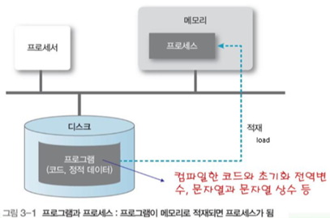
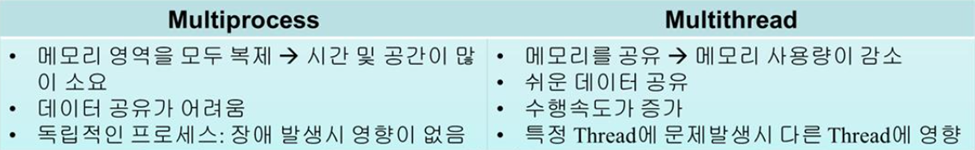

# CS_Week1

# 1주차 CS 정리

- [운영체제](https://github.com/gloriamok/2023_CS_PS_Study/blob/main/gloriamok/CS/Week1/CS_Week1.md#%EC%9A%B4%EC%98%81%EC%B2%B4%EC%A0%9Coperating-system%EB%9E%80)
- [인터럽트](https://github.com/gloriamok/2023_CS_PS_Study/blob/main/gloriamok/CS/Week1/CS_Week1.md#%EC%9D%B8%ED%84%B0%EB%9F%BD%ED%8A%B8%EB%9E%80)
- [메모리 계층](https://github.com/gloriamok/2023_CS_PS_Study/blob/main/gloriamok/CS/Week1/CS_Week1.md#%EB%A9%94%EB%AA%A8%EB%A6%AC-%EA%B3%84%EC%B8%B5%EA%B3%BC-%EA%B0%81-%EA%B3%84%EC%B8%B5%EC%9D%98-%ED%8A%B9%EC%A7%95)
- [프로세스 & 스레드](https://github.com/gloriamok/2023_CS_PS_Study/blob/main/gloriamok/CS/Week1/CS_Week1.md#%ED%94%84%EB%A1%9C%EC%84%B8%EC%8A%A4-process)
- [폰 노이만 구조](https://github.com/gloriamok/2023_CS_PS_Study/blob/main/gloriamok/CS/Week1/CS_Week1.md#%EC%BB%B4%ED%93%A8%ED%84%B0-%EA%B5%AC%EC%A1%B0---%ED%8F%B0-%EB%85%B8%EC%9D%B4%EB%A7%8C-%EA%B5%AC%EC%A1%B0)

# 운영체제(Operating System)란?

- 컴퓨터 하드웨어 바로 위에 설치되어 사용자 및 다른 모든 소프트웨어와 하드웨어를 연결하는 스프트웨어 계층
- 사용자가 하드웨어의 작동원리를 몰라도 하드웨어를 제어하고 최적화해서 효율적으로 활용할 수 있도록 도와주는 시스템 소프트웨어
- 사용자가 컴퓨터를 편리하고 효과적으로 사용할 수 있도록 환경을 제공하는 시스템 소프트웨어

](https://upload.wikimedia.org/wikipedia/commons/thumb/3/3a/Operating_system_placement_kor.svg/270px-Operating_system_placement_kor.svg.png)

출처: [운영체제 - 위키백과, 우리 모두의 백과사전 (wikipedia.org)](https://ko.wikipedia.org/wiki/%EC%9A%B4%EC%98%81%EC%B2%B4%EC%A0%9C)

## 운영체제의 역할

주요 역할 4가지

- **자원 관리:** CPU, 메모리와 같은 한정적인 시스템 자원을 효율적으로 관리
    - 실행중인 프로그램들에게 **CPU**를 번갈아 할당
    - 실행중인 프로그램들에 **메모리 공간**을 적절히 분배
- **프로세스 관리**: 프로세스의 생성, 스케줄링, 종료를 관리하며, 프로세스 간의 동기화와 통신을 제공
- **파일 시스템 관리**: 데이터의 저장, 검색, 수정 및 삭제를 위한 파일 관리와 디렉터리 구조를 제공
- **사용자 인터페이스 제공**: 사용자와 시스템 간의 상호작용을 가능하게 하는 인터페이스(명령줄, 그래픽 사용자 인터페이스)를 제공

## 운영체제의 구조/주요 구성요소

![출처: [[Operating System] 운영체제의 구조 :: wonseok.log (tistory.com)](https://math-coding.tistory.com/80)](https://img1.daumcdn.net/thumb/R1280x0/?scode=mtistory2&fname=https://blog.kakaocdn.net/dn/S3U2H/btqHxbOhB2V/WeQANBQKfm6F58xkWsJZy0/img.png)

출처: [[Operating System] 운영체제의 구조 :: wonseok.log (tistory.com)](https://math-coding.tistory.com/80)

](https://www.cs.uic.edu/~jbell/CourseNotes/OperatingSystems/images/Chapter2/2_01_OS_Services.jpg)

출처: [Operating Systems: Structures (uic.edu)](https://www.cs.uic.edu/~jbell/CourseNotes/OperatingSystems/2_Structures.html)

- **커널(Kernel)**
    - 운영체제의 핵심 부분으로, 하드웨어와 소프트웨어 간의 인터페이스 역할을 수행
    - 운영체제가 응용 프로그램에 제공하는 서비스 중 핵심 서비스는 **자원에 접근하고 조작하는 기능, 프로그램이 올바르고 안전하게 실행되게 하는 기능**
        - 이 핵심 서비스를 담당하는 부분이 커널
    - 커널의 종류에 따라 프로그램이 하드웨어를 이용하는 양상과 컴퓨터 전체의 성능이 달라질 수 있음
    - **커널의 역할**
        1. **자원 관리**: 커널은 CPU, 메모리, I/O 장치와 같은 시스템 자원을 관리하며, 이러한 자원들을 프로세스에 할당하고 회수합니다.
        2. **프로세스 관리**: 프로세스의 생성, 스케줄링, 종료를 담당하며, 프로세스 간의 동기화와 통신을 지원합니다.
        3. **메모리 관리**: 물리 메모리와 가상 메모리를 관리하며, 메모리 보호, 할당 및 회수를 담당합니다.
        4. **장치 드라이버 인터페이스**: 하드웨어 장치와의 통신을 위한 인터페이스를 제공하며, 장치 드라이버를 통해 다양한 하드웨어 장치를 관리합니다.
        5. **시스템 호출 인터페이스**: 사용자 레벨의 프로그램이 운영체제의 서비스를 요청할 수 있도록 시스템 호출 API를 제공합니다.
- **시스템 호출 (System Call)**
    - 응용 프로그램과 커널의 인터페이스로, 커널이 자신을 보호하기 위해 만든 인터페이스이다. 커널은 사용자나 응용 프로그램으로부터 컴퓨터 자원을 보호하기 위해 자원에 직접 접근하는 것을 차단한다.
    - **사용자 모드로 실행되는 프로그램**이 자원에 접근하는 운영체제 서비스를 제공받기 위한 요청
        - 시스템 호출을 통해 **커널 모드로 전환**하여 운영체제 서비스를 제공받을 수 있음

![출처: [[운영체제란?] 커널의 개념, 이중 모드와 시스템 호출 (hanbit.co.kr)](https://hongong.hanbit.co.kr/%EC%9A%B4%EC%98%81%EC%B2%B4%EC%A0%9C%EB%9E%80-%EC%BB%A4%EB%84%90%EC%9D%98-%EA%B0%9C%EB%85%90-%EC%9D%91%EC%9A%A9-%ED%94%84%EB%A1%9C%EA%B7%B8%EB%9E%A8-%EC%8B%A4%ED%96%89%EC%9D%84-%EC%9C%84%ED%95%9C/)](https://hongong.hanbit.co.kr/wp-content/uploads/2022/09/운영체제-커널모드-사용자모드-2.png)

출처: [[운영체제란?] 커널의 개념, 이중 모드와 시스템 호출 (hanbit.co.kr)](https://hongong.hanbit.co.kr/%EC%9A%B4%EC%98%81%EC%B2%B4%EC%A0%9C%EB%9E%80-%EC%BB%A4%EB%84%90%EC%9D%98-%EA%B0%9C%EB%85%90-%EC%9D%91%EC%9A%A9-%ED%94%84%EB%A1%9C%EA%B7%B8%EB%9E%A8-%EC%8B%A4%ED%96%89%EC%9D%84-%EC%9C%84%ED%95%9C/)

- **드라이버 (driver)**
    - 커널과 하드웨어의 인터페이스
- **유저 인터페이스**
    - 커널에 사용자의 명령을 전달하고 실행 결과를 사용자에게 알려주는 역할
    - 그래픽 유저 인터페이스 (GUI): 그래픽을 기반으로 컴퓨터와 상호작용하는 인터페이스
    - 커맨드 라인 인터페이스 (CLI): 명령어를 기반으로 컴퓨터와 상호작용하는 인터페이스

### 운영체제의 이중 모드 (dual mode)

- CPU가 명령어를 실행하는 모드를 구분하는 방식
- **사용자 모드 (user mode)**
    - 운영체제 서비스를 제공받을 수 없는 실행 모드
    - 커널 영역의 코드를 실행할 수 없는 모드
    - 자원에 접근할 수 없음
    - 일반적인 응용 프로그램은 기본적으로 사용자 모드로 실행됨
- **커널 모드 (kernel mode = system mode)**
    - 운영체제 서비스를 제공받을 수 있는 실행 모드
    - 커널 영역의 코드를 실행할 수 있는 모드
    - 자원에 접근할 수 있음

### 시스템 콜 예시

시스템 콜(system call)은 사용자 모드에서 실행되는 프로그램이 운영체제의 커널에 서비스를 요청할 때 사용하는 인터페이스입니다. 시스템 콜을 통해 프로그램은 파일 조작, 네트워크 통신, 프로세스 관리 등의 커널 수준의 작업을 요청할 수 있습니다.

다음은 일반적인 시스템 콜의 예시입니다:

1. **파일 관련 시스템 콜**:
    - `open()`: 파일을 열거나 생성합니다.
    - `read()`: 파일에서 데이터를 읽습니다.
    - `write()`: 파일에 데이터를 씁니다.
    - `close()`: 파일을 닫습니다.
    - `lseek()`: 파일 내의 특정 위치로 포인터를 이동합니다.
2. **프로세스 관련 시스템 콜**:
    - `fork()`: 새로운 프로세스를 생성합니다.
    - `exec()`: 프로세스에서 새로운 프로그램을 실행합니다.
    - `wait()`: 자식 프로세스의 종료를 기다립니다.
    - `exit()`: 프로세스를 종료합니다.
3. **메모리 관련 시스템 콜**:
    - `mmap()`: 메모리에 파일이나 장치를 매핑합니다.
    - `munmap()`: 메모리 매핑을 해제합니다.
    - `brk()`: 데이터 세그먼트의 크기를 변경합니다.
4. **네트워크 관련 시스템 콜**:
    - `socket()`: 소켓을 생성합니다.
    - `bind()`: 소켓에 주소를 연결합니다.
    - `listen()`: 소켓에서 연결 요청을 기다립니다.
    - `accept()`: 연결 요청을 수락합니다.
    - `send()`, `recv()`: 데이터를 송수신합니다.
5. **기타 시스템 콜**:
    - `ioctl()`: 장치 드라이버에 다양한 명령을 전달합니다.
    - `getpid()`: 현재 프로세스의 ID를 반환합니다.
    - `sleep()`: 프로세스를 일정 시간 동안 잠재웁니다.

이러한 시스템 콜들은 프로그램이 운영체제의 핵심 기능에 접근하고 이를 활용할 수 있게 해줍니다.

### 시스템 콜 처리 순서

시스템 콜(system call)은 사용자 모드에서 실행되는 프로그램이 커널 모드의 서비스를 요청할 때 사용하는 인터페이스입니다. 예를 들어, 파일을 열거나 네트워크 통신을 수행하려면 해당 작업을 수행하기 위한 시스템 콜을 사용해야 합니다.

CPU가 시스템 콜을 처리하는 기본적인 순서는 다음과 같습니다:

1. **시스템 콜 요청**:
    - 사용자 프로그램은 특정 서비스를 요청하기 위해 시스템 콜을 호출합니다.
2. **사용자 모드에서 커널 모드로 전환**:
    - 시스템 콜은 커널 모드에서 실행되므로, CPU는 사용자 모드에서 커널 모드로 전환합니다. 이 전환은 특별한 명령어를 통해 수행됩니다.
3. **시스템 콜 번호 및 인자 확인**:
    - 각 시스템 콜은 고유한 번호를 가지고 있습니다. CPU는 이 번호를 확인하여 어떤 시스템 콜이 요청되었는지 파악합니다.
    - 또한, 시스템 콜에 전달된 인자도 확인하여 해당 서비스를 수행하기 위한 정보를 얻습니다.
4. **시스템 콜 처리**:
    - 커널은 시스템 콜 번호와 인자를 기반으로 해당 서비스를 수행합니다. 예를 들어, 파일 열기 시스템 콜이 요청되면, 커널은 해당 파일을 열고 파일 디스크립터를 반환합니다.
5. **결과 반환**:
    - 시스템 콜의 처리가 완료되면, 결과를 사용자 프로그램에 반환합니다. 이 결과는 성공, 실패, 또는 특정 값을 포함할 수 있습니다.
6. **커널 모드에서 사용자 모드로 전환**:
    - 시스템 콜 처리가 완료된 후, CPU는 커널 모드에서 사용자 모드로 다시 전환하고, 사용자 프로그램의 다음 명령어를 실행합니다.

이러한 과정을 통해 사용자 프로그램은 운영체제의 서비스를 안전하게 이용할 수 있습니다. 시스템 콜을 사용하면 사용자 프로그램은 직접 하드웨어 자원에 접근하는 대신, 운영체제를 통해 필요한 서비스를 요청하고 결과를 받아올 수 있습니다.

# 인터럽트란?

인터럽트는 CPU에게 어떤 사건이 발생했음을 알리는 신호 또는 메커니즘을 의미합니다. 인터럽트는 CPU가 현재 실행 중인 작업을 일시 중단하고, 인터럽트를 처리하기 위한 특정 루틴(인터럽트 서비스 루틴)을 실행하도록 합니다. 인터럽트 처리가 완료된 후에는 원래의 작업을 계속 수행합니다.

## 인터럽트 종류와 특징

1. **비동기/하드웨어 인터럽트 (Hardware Interrupt)**:
    - 외부 하드웨어 장치나 이벤트에 의해 발생합니다. 예를 들어, 키보드 키 입력, 마우스 클릭, 타이머 만료, I/O 작업 완료 등이 있습니다.
    - 하드웨어 장치는 특정 사건이 발생했을 때 인터럽트 신호를 CPU에게 전송합니다.
2. **소프트웨어 인터럽트 (Software Interrupt)**:
    - 프로그램의 실행 중에 소프트웨어나 운영체제에 의해 발생합니다.
    - 주로 예외 상황(예: 0으로 나누기)이나 특정 시스템 호출(system call)을 수행하기 위해 발생합니다.
3. **내부 인터럽트 (Internal Interrupt)**:
    - CPU 내부의 예외 상황에 의해 발생합니다.
    - 예를 들어, 연산 오류, 메모리 접근 오류 등이 있습니다.

## 하드웨어 인터럽트 처리 순서

1. **인터럽트 발생**:
    - 하드웨어 장치가 특정 이벤트나 조건에 의해 **인터럽트 요청 신호**를 CPU에게 전송합니다.
2. **현재 실행 중인 작업 저장**:
    - CPU는 인터럽트가 발생하면 **현재 실행 중인 작업의 상태를 저장**합니다. 이를 통해 인터럽트 처리 후 원래의 작업을 계속 수행할 수 있습니다.
    - 주로 프로세서의 레지스터, 프로그램 카운터, 플래그 등의 상태를 스택에 저장합니다.
3. **인터럽트 서비스 루틴 (ISR) 실행**:
    - 각 인터럽트 요청에는 고유한 **인터럽트 벡터**가 있으며, 이 벡터는 해당 인터럽트를 처리하기 위한 인터럽트 서비스 루틴(ISR)의 주소를 가리킵니다.
    - CPU는 인터럽트 벡터를 통해 해당 ISR의 주소를 찾아서 **ISR을 실행**합니다.
4. **인터럽트 처리**:
    - ISR 내에서 인터럽트의 원인을 파악하고 필요한 작업을 수행합니다. 예를 들어, I/O 작업의 완료, 타이머 만료, 키보드 입력 등의 이벤트를 처리합니다.
5. **원래의 작업 복구 및 계속 수행**:
    - 인터럽트 처리가 완료되면, **스택에 저장된 원래의 작업 상태를 복구**합니다.
    - 프로세서의 레지스터, 프로그램 카운터, 플래그 등의 상태를 복원하고, 원래의 작업을 계속 수행합니다.
6. **인터럽트 종료**:
    - 모든 처리가 완료되면, 인터럽트는 종료되며, CPU는 다음 인터럽트 요청이나 일반 작업을 계속 수행합니다.
- 인터럽트 서비스 루틴(=인터럽트 핸들러): 인터럽트를 처리하기 위한 프로그램, 어떤 인터럽트가 발생했을 때 해당 인터럽트를 어ㄸ허게 처리하고 작동해아할 지에 대한 정보로 이루어진 프로그램
- 인터럽트 벡터: 인터럽트 서비스 루틴을 식별하기 위한 정보, 인터럽트 서비스 루틴의 시작 주소를 알 수 있음

# 메모리 계층과 각 계층의 특징

](https://github.com/devSquad-study/2023-CS-Study/raw/main/OS/img/os_memory_hierarchy.png)

출처: [2023-CS-Study/OS/os_memory_hierarchy.md at main · devSquad-study/2023-CS-Study (github.com)](https://github.com/devSquad-study/2023-CS-Study/blob/main/OS/os_memory_hierarchy.md)

| 명칭 | 위치 | 접근속도 | 기억용량 | 휘발성여부 |
| --- | --- | --- | --- | --- |
| 레지스터 | CPU 내부 | 가장 빠름 | 가장 적음 | 휘발성 |
| 캐시 | CPU 내부/외부 | 빠름 | 적음 | 휘발성 |
| 메모리(주기억장치) | CPU 외부 | 보통 | 보통 | 휘발성 |
| 하드 디스크(보조기억장치) | CPU 직접 접근 불가 | 낮음 | 많음 | 비휘발성 |

- 메모리 계층 구조는 시스템의 전체 성능과 비용을 최적화하기 위해 설계됨
1. **레지스터 (Registers)**
    - 현재 실행 중인 명령어의 데이터나 중간 결과를 임시로 저장하는 데 사용됩니다.
2. **캐시 메모리 (Cache Memory)**
    - CPU와 주 메모리 사이에 위치하는 고속의 작은 메모리
    - SRAM(Static Random Access Memory) 기반으로 제작되어 주 메모리보다 훨씬 빠른 접근 속도를 가집니다.
    - 자주 사용되는 데이터나 명령어를 빠르게 접근하기 위해 저장하는 데 사용됩니다.
3. **주 메모리 (Main Memory 또는 RAM)**
    - 실행 중인 프로그램과 데이터를 저장하는 데 사용됩니다.
4. **보조 메모리 (Secondary Memory)**:
    - 하드 디스크, SSD, CD, DVD 등의 저장 장치로, 데이터를 영구적으로 저장하는 데 사용됩니다.
5. **오프라인 스토리지 (Offline Storage)**:
    - 데이터를 오프라인 상태에서 저장하며, 접근 속도는 가장 느립니다.
    - 테이프 드라이브, 외부 하드 드라이브, USB 드라이브 등으로, 백업이나 아카이브 목적으로 사용됩니다.

## 캐시

- **사용되었던 데이터는 다시 사용되어질 가능성이 높다**는 개념을 이용하여 데이터나 값을 **미리 복사해 놓는 임시 장소**
- 주요 목적: CPU의 성능을 향상시키기 위해 메모리 접근 시간을 최소화하는 것 (CPU의 레지스터 접근 시간과 메모리 접근 시간 사이의 시간 간극을 좁혀줌)
- **참조 지역성 원리**를 활용하여 캐시에 어떤 데이터를 저장할지 결정
    - **참조 지역성 원리:** 프로그램이 어떤 위치의 메모리를 참조하면, 가까운 미래에 다시 그 위치의 메모리와 그 근처의 메모리를 참조할 가능성이 높다.
    - **시간적 지역성 (Temporal Locality)**:
        - **프로그램이 한 번 메모리 위치를 참조하면, 가까운 미래에 다시 그 위치를 참조할 가능성이 높습니다.** 예를 들어, 루프 내에서 반복적으로 사용되는 변수는 시간적 지역성을 가집니다.
    1. **공간적 지역성 (Spatial Locality)**:
        - **프로그램이 메모리의 특정 위치를 참조하면, 그 위치의 근처에 있는 메모리도 곧 참조될 가능성이 높습니다.** 예를 들어, 연속된 메모리 위치에 저장된 배열의 요소들을 순차적으로 접근하는 경우 공간적 지역성이 나타납니다.
- **계층 구조**: 현대의 컴퓨터 시스템에서는 여러 레벨의 캐시 메모리를 사용하는 경우가 많습니다. 일반적으로 L1, L2, L3 등의 계층으로 구성되며, L1은 CPU에 가장 가깝고 L3는 가장 멀리 위치합니다.
- **작동 원리**
    - **캐시 히트 (Cache Hit)**: CPU가 캐시 메모리에서 필요한 데이터나 명령어를 찾았을 때 발생합니다.
    - **캐시 미스 (Cache Miss)**: CPU가 캐시 메모리에서 필요한 데이터나 명령어를 찾지 못했을 때 발생합니다. 이 경우, 데이터는 주 메모리에서 가져와 캐시에 저장되며, 이후의 접근을 위해 사용됩니다.
- **교체 알고리즘**: 캐시 메모리는 제한된 용량을 가지기 때문에 새로운 데이터를 저장할 때 기존의 데이터를 어떻게 교체할지 결정하는 교체 알고리즘이 필요합니다. LRU(Least Recently Used), FIFO(First In First Out) 등의 교체 알고리즘이 사용됩니다.
- **쓰기 정책**: 캐시 메모리에 데이터를 쓸 때의 정책을 결정하는 방법입니다. 주요 정책으로는 Write Through와 Write Back이 있습니다.

## 주 메모리(RAM)

- 컴퓨터 시스템에서 중요한 역할을 하는 핵심 구성 요소
- CPU가 직접 접근할 수 있는 저장 매체 중에서 가장 빠른 접근 시간을 가짐
- **실행 중인 프로그램의 코드, 변수, 데이터 구조 및 스택**과 같은 중요한 정보는 주 메모리에 저장됨
- **동적으로 할당되고 해제될 수 있는 데이터를 저장**하는 데 사용됨. 예를 들어, 프로그램이 실행되면 필요한 메모리 공간이 할당되고, 프로그램이 종료되면 해당 공간이 해제됨
- **CPU와 보조 저장 장치(예: 하드 드라이브, SSD) 사이의 다리 역할**을 함. 데이터는 먼저 주 메모리로 로드되고, CPU는 주 메모리에서 직접 데이터를 처리
- 종종 캐시나 버퍼로 사용되어 입출력 연산의 효율성을 높임. 예를 들어, 디스크에서 데이터를 읽을 때 일정량의 데이터를 미리 주 메모리에 로드하여 빠른 접근을 가능하게 함
- 주 메모리의 크기와 효율성은 시스템의 전반적인 반응성과 성능에 큰 영향을 미침. 충분한 주 메모리가 없으면 시스템은 스왑 영역(디스크 기반의 가상 메모리)을 사용해야 하며, 이로 인해 성능 저하가 발생할 수 있음

# 프로세스 (Process)

- **프로그램**
    - 저장장치에 저장되어 있는 정적인 상태
- **프로세스**
    - 프로그램이 활성화 되어있는 상태
    - 실행 중인 프로그램의 인스턴스로, 시스템 자원과 메모리 공간을 독립적으로 할당받아 실행됨

## 프로세스의 구조/구성요소

](https://github.com/devSquad-study/2023-CS-Study/raw/main/OS/img/os-process.png)

출처: [2023-CS-Study/OS/os_process_thread.md at main · devSquad-study/2023-CS-Study (github.com)](https://github.com/devSquad-study/2023-CS-Study/blob/main/OS/os_process_thread.md)

- 각 프로세스는 독립적인 메모리 공간, 데이터 섹션, 힙, 스택을 가짐
1. **텍스트(코드) 섹션 (Text Section)**:
    - **역할**: 프로세스의 실행 코드를 포함한다. 이 섹션은 읽기 전용이며, 프로그램의 실제 명령어들이 저장된다.
2. **데이터 섹션 (Data Section)**:
    - **역할**: 전역 변수와 정적 변수를 저장한다. 프로그램이 시작될 때 초기화되며, 프로그램이 종료될 때까지 유지된다.
3. **힙 (Heap)**:
    - **역할**: 동적 메모리 할당을 위한 영역이다. 프로그램 실행 중에 필요에 따라 메모리를 할당하거나 해제하는 데 사용된다. 예를 들어, C 언어에서 `malloc()` 또는 `free()` 함수를 사용하여 메모리를 동적으로 할당하거나 해제할 때 이 영역이 사용된다.
4. **스택 (Stack)**:
    - **역할**: 지역 변수, 함수 매개변수, 반환 주소 및 프로세스의 실행 흐름과 관련된 정보를 저장한다. 함수 호출 시 생성되는 프레임은 스택에 저장되며, 함수가 종료될 때 해당 프레임은 스택에서 제거된다.
5. **PCB (Process Control Block)**:
    - **역할**: 프로세스의 상태, 프로세스 ID, 프로그램 카운터, CPU 레지스터 값, CPU 스케줄링 정보, 메모리 관리 정보 등 프로세스와 관련된 모든 정보를 저장하는 데이터 구조이다. 운영체제는 PCB를 사용하여 프로세스를 관리한다.
        - **프로그램 카운터 (PC)**: 프로세스를 실행하는 다음 명령의 주소 표시

## 스레드 (Thread)

](https://github.com/devSquad-study/2023-CS-Study/raw/main/OS/img/os_thread.png)

출처: [2023-CS-Study/OS/os_process_thread.md at main · devSquad-study/2023-CS-Study (github.com)](https://github.com/devSquad-study/2023-CS-Study/blob/main/OS/os_process_thread.md)

- 프로세스 내에서 실행되는 여러 흐름의 단위로, 프로세스의 자원을 공유하면서 실행됨
- 하나의 프로그램은 하나 이상의 프로세스를 가지고 있고, 하나의 프로세스는 반드시 하나 이상의 스레드를 가짐
- 스레드는 프로세스의 메모리 공간을 공유하며, 각 스레드는 자신만의 레지스터 세트와 스택을 가짐

## 프로세스 vs. 스레드

- 프로세스와 스레드는 컴퓨터 시스템에서 실행되는 프로그램의 단위
1. **자원 할당**: 프로세스는 독립적인 메모리 공간을 가지며, 스레드는 프로세스의 메모리를 공유합니다.
2. **통신 방법**: 프로세스 간 통신은 복잡한 IPC(Inter-Process Communication) 메커니즘(ex. 파이프, 소켓, 메시지 큐)을 필요로 하지만, 스레드 간 통신은 프로세스의 메모리 공간을 공유하기 때문에 간단합니다.
3. **생성 및 종료 속도**: 스레드의 생성 및 종료는 프로세스에 비해 빠르며 자원 소모가 적습니다.
4. **오버헤드**: 프로세스 간 전환의 오버헤드는 크지만, 스레드 간 전환의 오버헤드는 작습니다.

## 멀티 프로세스 vs. 멀티 스레드

](https://user-images.githubusercontent.com/31475037/103182666-9db27000-48f0-11eb-986a-23fa66954a74.png)

출처: [고성능 파이썬 프로그래밍 3 - 멀티프로세싱과 멀티스레딩 (chacha95.github.io)](https://chacha95.github.io/2020-12-19-python4/)

### 멀티 프로세스

- 하나의 프로그램을 여러 프로세스로 구성하는 방식
- context switching 과정에서 캐시 메모리 초기화와 같은 작업이 추가로 요구되어 **오버헤드**가 큼
- 프로세스간 공유하는 자원이 없기에, 동일한 자원에 동시 접근해서 발생하는 critical section 문제(dead lock)가 발생하지 않음
    - **공유 메모리 (Shared Memory) 사용 시에는 발생함**
- **Context Switching**
    - CPU에서 여러 프로세스를 돌아가면서 작업을 처리하는데 이 과정을 Context Swiching이라고 한다.
    - 동작중인 프로세스가 대기를 하면서 해당 프로세스의 상태(Context)를 보관하고 대기하고 있다가 다시 실행시 복구하는 비용(시간)을 의미한다.

### 멀티 스레드

- 하나의 프로그램을 여러 스레드로 구성하는 방식
- stack 영역을 제외한 **메모리를 공유**하기에, context switch시 캐시 메모리를 비울 필요가 없고 이를 통해 **컴퓨팅 리소스 절약 가능**
- 서로 다른 스레드가 데이터와 힙 영역을 공유하기 때문에 **critical section 문제(deadlock)**이 발생할 수 있음

## 멀티프로그래밍, 멀티프로세싱, 멀티 스레딩과 멀티테스킹의 특징과 장점, 단점, 차이점

- 멀티프로그래밍, 멀티프로세싱, 멀티 스레딩, 멀티테스킹은 컴퓨터 시스템에서 여러 작업을 동시에 처리하는 방식을 나타내는 용어입니다.

### 멀티프로그래밍 (Multiprogramming)

- **특징**: 여러 프로그램이 메모리에 동시에 올라가 있어 CPU가 항상 작업을 처리할 수 있도록 설계된 시스템.
- **장점**:
    - CPU의 사용률을 최대화한다.
    - CPU 대기 시간을 줄인다.
- **단점**:
    - 메모리 관리가 복잡해질 수 있다.
- **차이점**: CPU의 사용률을 최대화하는 것을 목표로 하며, 실제로 여러 프로그램이 동시에 실행되는 것은 아니다.

### 멀티프로세싱 (Multiprocessing)

- **특징**: 여러 CPU 또는 CPU 코어를 사용하여 여러 프로세스를 동시에 처리하는 시스템.
- **장점**:
    - 병렬 처리를 통해 시스템의 성능과 처리량을 향상시킨다.
    - 복잡한 작업을 빠르게 처리할 수 있다.
- **단점**:
    - 하드웨어 비용이 증가할 수 있다.
    - 병렬 프로그래밍이 복잡해질 수 있다.
- **차이점**: 실제로 여러 CPU를 사용하여 여러 작업을 동시에 처리한다.

### 멀티 스레딩 (Multithreading)

- **특징**: 단일 프로세스 내에서 여러 스레드를 생성하여 병렬로 작업을 수행하는 시스템.
- **장점**:
    - 자원을 효율적으로 사용한다.
    - 응답 시간을 개선하고 CPU 사용률을 향상시킨다.
    - 메모리 오버헤드가 적다.
- **단점**:
    - 스레드 간의 동기화 문제가 발생할 수 있다.
    - 데이터 일관성을 유지하기 위한 복잡한 프로그래밍이 필요하다.
- **차이점**: 단일 프로세스 내에서 여러 작업을 동시에 처리한다.

### 멀티테스킹 (Multitasking)

- **특징**: 단일 CPU에서 여러 프로세스 또는 스레드를 시간을 나눠서 번갈아 가며 실행하는 시스템.
- **장점**:
    - 여러 작업을 동시에 처리할 수 있다.
    - 사용자와의 상호 작용이 향상된다.
- **단점**:
    - 컨텍스트 스위칭으로 인한 오버헤드가 발생할 수 있다.
- **차이점**: 실제로 동시에 여러 작업이 실행되는 것이 아니라, 작업 간에 빠르게 전환되어 동시에 실행되는 것처럼 보이게 한다.

### 요약

- **멀티프로그래밍**: CPU의 사용률을 최대화하기 위해 여러 프로그램을 메모리에 동시에 로드한다.
- **멀티프로세싱**: 여러 CPU를 사용하여 여러 작업을 동시에 처리한다.
- **멀티 스레딩**: 단일 프로세스 내에서 여러 작업을 동시에 처리한다.
- **멀티테스킹**: 단일 CPU에서 여러 작업을 번갈아 가며 실행하여 동시에 실행되는 것처럼 보이게 한다.

이 네 가지 용어는 모두 컴퓨터 시스템의 효율성과 성능을 향상시키기 위한 방법을 나타내지만, 사용되는 방식과 목표가 다르다.

# 컴퓨터 구조 - 폰 노이만 구조

폰 노이만 구조(Von Neumann architecture)는 1945년에 John Von Neumann이 제안한 컴퓨터의 구조적 설계 원리를 의미합니다. 이 구조는 현대의 대부분의 컴퓨터와 유사한 방식으로 작동하며, 주요 특징은 명령어와 데이터가 동일한 메모리에 저장되는 것입니다.

폰 노이만 구조의 주요 구성 요소 및 특징은 다음과 같습니다:

### 주요 구성 요소

1. **중앙 처리 장치 (CPU)**: 연산과 제어를 담당하는 핵심 부품입니다.
2. **메모리 (Memory)**: 명령어와 데이터를 저장하는 공간입니다.
3. **입력 장치 (Input)**: 사용자나 다른 시스템으로부터 데이터를 입력받는 장치입니다.
4. **출력 장치 (Output)**: 처리 결과를 사용자나 다른 시스템에 전달하는 장치입니다.
5. **제어 장치 (Control Unit)**: CPU 내부에 위치하며, 명령어의 해석과 실행을 제어합니다.
6. **산술 논리 장치 (ALU, Arithmetic Logic Unit)**: 산술 및 논리 연산을 수행하는 부분입니다.

### 특징

1. **저장 프로그램 구조**: 명령어와 데이터가 동일한 메모리에 저장됩니다. 이로 인해 프로그램의 명령어를 변경하거나 새로운 프로그램을 로드하는 것이 가능해집니다.
2. **순차적 실행**: 명령어는 순차적으로 하나씩 실행됩니다. 하나의 명령어가 완료된 후 다음 명령어가 실행됩니다.
3. **데이터와 명령어의 구분**: 메모리 내에서 데이터와 명령어는 구분되지 않습니다. 이는 명령어와 데이터가 동일한 형식으로 저장되기 때문입니다.

폰 노이만 구조는 초기 컴퓨터 설계의 기본 원리로 사용되었으며, **현대의 대부분의 컴퓨터는 이 구조를 기반으로 설계되고 있습니다.** 그러나 이 구조의 한계로 인해 다양한 대안적인 컴퓨터 아키텍처가 연구되고 있습니다.

# 내용출처

- [혼자 공부하는 컴퓨터 구조+운영체제 - 예스24 (yes24.com)](https://www.yes24.com/Product/Goods/111378840)
- [2023-CS-Study/OS/README.md at main · devSquad-study/2023-CS-Study (github.com)](https://github.com/devSquad-study/2023-CS-Study/blob/main/OS/README.md)
- [ChatGPT (openai.com)](https://chat.openai.com/)