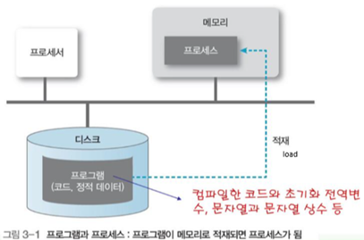

# os-process-and-thread

# 프로세스 (Process)

- **프로그램**
    - 저장장치에 저장되어 있는 정적인 상태
- **프로세스**
    - 프로그램이 활성화 되어있는 상태
    - 실행 중인 프로그램의 인스턴스로, 시스템 자원과 메모리 공간을 독립적으로 할당받아 실행됨

## 프로세스의 구조/구성요소

](https://github.com/devSquad-study/2023-CS-Study/raw/main/OS/img/os-process.png)

출처: [2023-CS-Study/OS/os_process_thread.md at main · devSquad-study/2023-CS-Study (github.com)](https://github.com/devSquad-study/2023-CS-Study/blob/main/OS/os_process_thread.md)

- 각 프로세스는 독립적인 메모리 공간, 데이터 섹션, 힙, 스택을 가짐
1. **텍스트(코드) 섹션 (Text Section)**:
    - **역할**: 프로세스의 실행 코드를 포함한다. 이 섹션은 읽기 전용이며, 프로그램의 실제 명령어들이 저장된다.
2. **데이터 섹션 (Data Section)**:
    - **역할**: 전역 변수와 정적 변수를 저장한다. 프로그램이 시작될 때 초기화되며, 프로그램이 종료될 때까지 유지된다.
3. **힙 (Heap)**:
    - **역할**: 동적 메모리 할당을 위한 영역이다. 프로그램 실행 중에 필요에 따라 메모리를 할당하거나 해제하는 데 사용된다. 예를 들어, C 언어에서 `malloc()` 또는 `free()` 함수를 사용하여 메모리를 동적으로 할당하거나 해제할 때 이 영역이 사용된다.
4. **스택 (Stack)**:
    - **역할**: 지역 변수, 함수 매개변수, 반환 주소 및 프로세스의 실행 흐름과 관련된 정보를 저장한다. 함수 호출 시 생성되는 프레임은 스택에 저장되며, 함수가 종료될 때 해당 프레임은 스택에서 제거된다.
5. **PCB (Process Control Block)**:
    - **역할**: 프로세스의 상태, 프로세스 ID, 프로그램 카운터, CPU 레지스터 값, CPU 스케줄링 정보, 메모리 관리 정보 등 프로세스와 관련된 모든 정보를 저장하는 데이터 구조이다. 운영체제는 PCB를 사용하여 프로세스를 관리한다.
        - **프로그램 카운터 (PC)**: 프로세스를 실행하는 다음 명령의 주소 표시

## 스레드 (Thread)

](https://github.com/devSquad-study/2023-CS-Study/raw/main/OS/img/os_thread.png)

출처: [2023-CS-Study/OS/os_process_thread.md at main · devSquad-study/2023-CS-Study (github.com)](https://github.com/devSquad-study/2023-CS-Study/blob/main/OS/os_process_thread.md)

- 프로세스 내에서 실행되는 여러 흐름의 단위로, 프로세스의 자원을 공유하면서 실행됨
- 하나의 프로그램은 하나 이상의 프로세스를 가지고 있고, 하나의 프로세스는 반드시 하나 이상의 스레드를 가짐
- 스레드는 프로세스의 메모리 공간을 공유하며, 각 스레드는 자신만의 레지스터 세트와 스택을 가짐

## 프로세스 vs. 스레드

- 프로세스와 스레드는 컴퓨터 시스템에서 실행되는 프로그램의 단위
1. **자원 할당**: 프로세스는 독립적인 메모리 공간을 가지며, 스레드는 프로세스의 메모리를 공유합니다.
2. **통신 방법**: 프로세스 간 통신은 복잡한 IPC(Inter-Process Communication) 메커니즘(ex. 파이프, 소켓, 메시지 큐)을 필요로 하지만, 스레드 간 통신은 프로세스의 메모리 공간을 공유하기 때문에 간단합니다.
3. **생성 및 종료 속도**: 스레드의 생성 및 종료는 프로세스에 비해 빠르며 자원 소모가 적습니다.
4. **오버헤드**: 프로세스 간 전환의 오버헤드는 크지만, 스레드 간 전환의 오버헤드는 작습니다.

## 멀티 프로세싱 vs. 멀티 스레딩

](https://user-images.githubusercontent.com/31475037/103182666-9db27000-48f0-11eb-986a-23fa66954a74.png)

출처: [고성능 파이썬 프로그래밍 3 - 멀티프로세싱과 멀티스레딩 (chacha95.github.io)](https://chacha95.github.io/2020-12-19-python4/)

### **멀티 프로세싱**

- 하나의 프로그램을 여러 프로세스로 구성하는 방식
- context switching 과정에서 캐시 메모리 초기화와 같은 작업이 추가로 요구되어 오버헤드가 큼
- 프로세스간 공유하는 자원이 없기에, 동일한 자원에 동시 접근해서 발생하는 critical section 문제(dead lock)가 발생하지 않음
- Context Switching
    - CPU에서 여러 프로세스를 돌아가면서 작업을 처리하는데 이 과정을 Context Swiching이라고 한다.
    - 동작중인 프로세스가 대기를 하면서 해당 프로세스의 상태(Context)를 보관하고 대기하고 있다가 다시 실행시 복구하는 비용(시간)을 의미한다.

### **멀티 스레딩**

- 하나의 프로그램을 여러 스레드로 구성하는 방식
- stack 영역을 제외한 메모리를 공유하기에, context switch시 캐시 메모리를 비울 필요가 없고 이를 통해 컴퓨팅 리소스 절약 가능
- 서로 다른 스레드가 데이터와 힙 영역을 공유하기 때문에 critical section 문제(deadlock)이 발생할 수 있음

## 멀티프로그래밍, 멀티프로세싱, 멀티 스레딩과 멀티테스킹의 특징과 장점, 단점, 차이점

- 멀티프로그래밍, 멀티프로세싱, 멀티 스레딩, 멀티테스킹은 컴퓨터 시스템에서 여러 작업을 동시에 처리하는 방식을 나타내는 용어입니다.

### 멀티프로그래밍 (Multiprogramming)

- **특징**: 여러 프로그램이 메모리에 동시에 올라가 있어 CPU가 항상 작업을 처리할 수 있도록 설계된 시스템.
- **장점**:
    - CPU의 사용률을 최대화한다.
    - CPU 대기 시간을 줄인다.
- **단점**:
    - 메모리 관리가 복잡해질 수 있다.
- **차이점**: CPU의 사용률을 최대화하는 것을 목표로 하며, 실제로 여러 프로그램이 동시에 실행되는 것은 아니다.

### 멀티프로세싱 (Multiprocessing)

- **특징**: 여러 CPU 또는 CPU 코어를 사용하여 여러 프로세스를 동시에 처리하는 시스템.
- **장점**:
    - 병렬 처리를 통해 시스템의 성능과 처리량을 향상시킨다.
    - 복잡한 작업을 빠르게 처리할 수 있다.
- **단점**:
    - 하드웨어 비용이 증가할 수 있다.
    - 병렬 프로그래밍이 복잡해질 수 있다.
- **차이점**: 실제로 여러 CPU를 사용하여 여러 작업을 동시에 처리한다.

### 멀티 스레딩 (Multithreading)

- **특징**: 단일 프로세스 내에서 여러 스레드를 생성하여 병렬로 작업을 수행하는 시스템.
- **장점**:
    - 자원을 효율적으로 사용한다.
    - 응답 시간을 개선하고 CPU 사용률을 향상시킨다.
    - 메모리 오버헤드가 적다.
- **단점**:
    - 스레드 간의 동기화 문제가 발생할 수 있다.
    - 데이터 일관성을 유지하기 위한 복잡한 프로그래밍이 필요하다.
- **차이점**: 단일 프로세스 내에서 여러 작업을 동시에 처리한다.

### 멀티테스킹 (Multitasking)

- **특징**: 단일 CPU에서 여러 프로세스 또는 스레드를 시간을 나눠서 번갈아 가며 실행하는 시스템.
- **장점**:
    - 여러 작업을 동시에 처리할 수 있다.
    - 사용자와의 상호 작용이 향상된다.
- **단점**:
    - 컨텍스트 스위칭으로 인한 오버헤드가 발생할 수 있다.
- **차이점**: 실제로 동시에 여러 작업이 실행되는 것이 아니라, 작업 간에 빠르게 전환되어 동시에 실행되는 것처럼 보이게 한다.

### 요약

- **멀티프로그래밍**: CPU의 사용률을 최대화하기 위해 여러 프로그램을 메모리에 동시에 로드한다.
- **멀티프로세싱**: 여러 CPU를 사용하여 여러 작업을 동시에 처리한다.
- **멀티 스레딩**: 단일 프로세스 내에서 여러 작업을 동시에 처리한다.
- **멀티테스킹**: 단일 CPU에서 여러 작업을 번갈아 가며 실행하여 동시에 실행되는 것처럼 보이게 한다.

이 네 가지 용어는 모두 컴퓨터 시스템의 효율성과 성능을 향상시키기 위한 방법을 나타내지만, 사용되는 방식과 목표가 다르다.