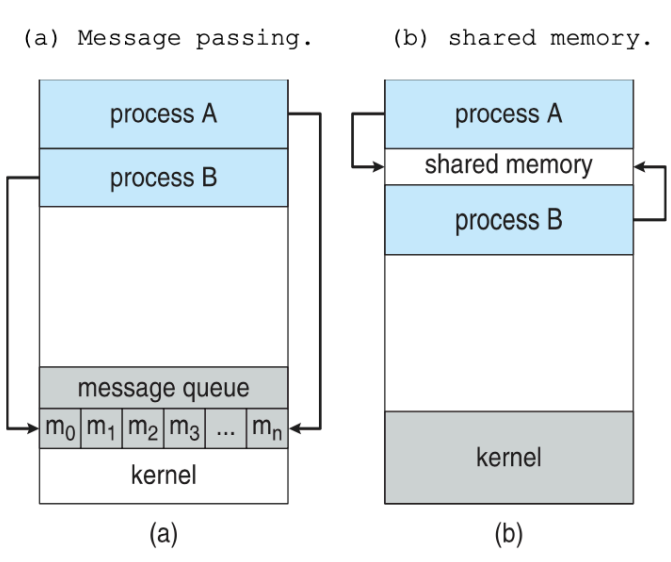

# CS_Week2

# 2주차 CS 정리

# 프로세스의 구조/구성요소

](https://github.com/devSquad-study/2023-CS-Study/raw/main/OS/img/os-process.png)

출처: [2023-CS-Study/OS/os_process_thread.md at main · devSquad-study/2023-CS-Study (github.com)](https://github.com/devSquad-study/2023-CS-Study/blob/main/OS/os_process_thread.md)

- 프로세스는 프로그램이 활성화 되어있는 상태
- 각 프로세스는 독립적인 메모리 공간, 코드, 데이터 섹션, 힙, 스택을 가짐
1. **텍스트(코드) 섹션 (Text Section)**:
    - 프로세스의 실행 코드를 포함한다. 프로그램의 실제 명령어들이 저장된다.
    - 이 섹션은 읽기 전용으로 설정되어 있어, 실행 중에는 변경되지 않는다.
2. **데이터 섹션 (Data Section)**:
    - 초기화된 전역(global) 변수와 정적(static) 변수를 저장한다.
    - 프로그램이 시작 시 초기값이 할당되며, 프로세스 실행 중에 변경될 수 있다.
    - 프로그램이 종료될 때까지 유지된다.
3. **힙 (Heap)**:
    - 동적 메모리 할당을 위한 영역이다.
    - 프로그램 실행 중에 필요에 따라 메모리를 할당하거나 해제하는 데 사용된다.
        - 예를 들어, C 언어에서 `malloc()` 또는 `free()` 함수를 사용하여 메모리를 동적으로 할당하거나 해제할 때 이 영역이 사용된다.
    - 힙은 메모리 주소의 낮은 위치에서 높은 위치로 증가하는 방향으로 확장됩니다.
4. **스택 (Stack)**:
    - 임시 메모리 영역으로, 변수, 함수 매개변수, 반환 주소 및 프로세스의 실행 흐름과 관련된 정보 등 잠시 사용되었다가 사라지는 데이터를 저장하는 영역이다.
    - **함수 호출 시 생성**되는 프레임은 스택에 저장되며, **함수가 종료될 때** 해당 프레임은 스택에서 **제거**된다.
    - 스택은 메모리 주소의 높은 위치에서 낮은 위치로 감소하는 방향으로 확장됩니다.
5. **PCB (Process Control Block)**:
    - 프로세스의 상태, 프로세스 ID, 프로그램 카운터, CPU 레지스터 값, CPU 스케줄링 정보, 메모리 관리 정보 등 **프로세스와 관련된 모든 정보를 저장하는 데이터 구조**이다.
        - **프로그램 카운터 (Program Counter, PC)**: 중앙 처리 장치(CPU)의 레지스터 중 하나로, 다음에 실행될 명령어의 메모리 주소를 가리킴
        - 프로그램 카운터가 필요한 이유
            - 프로그램 카운터는 프로그램의 실행 흐름을 제어하고 관리하는 데 필수적인 구성 요소이다.
            1. **순차적 실행**: 대부분의 프로그램은 순차적으로 명령어를 실행한다. 프로그램 카운터는 현재 실행 중인 명령어 바로 다음의 명령어 주소를 가리키므로, CPU는 프로그램 카운터의 값을 참조하여 다음 명령어를 가져와 실행할 수 있다.
            2. **제어 전송**: 조건 분기나 무조건 분기와 같은 제어 전송 명령어를 사용할 때, 프로그램 카운터의 값이 변경된다. 이를 통해 프로그램의 실행 흐름을 변경할 수 있다.
            3. **함수 호출과 반환**: 함수나 서브루틴을 호출할 때, 반환 주소(즉, 호출 명령어 바로 다음의 주소)가 스택에 저장된다. 함수 실행이 완료되면 이 반환 주소를 프로그램 카운터에 로드하여 원래의 실행 흐름으로 돌아간다.
            4. **중단과 예외 처리**: 인터럽트나 예외가 발생하면 현재의 프로그램 카운터 값이 저장되고, 해당 인터럽트나 예외를 처리하는 루틴의 주소가 프로그램 카운터에 로드된다. 처리가 완료되면 원래의 프로그램 카운터 값으로 복원되어 원래의 실행 흐름을 갖는다.
            5. **멀티태스킹**: 멀티태스킹 환경에서는 여러 프로세스나 스레드가 번갈아가며 CPU를 사용한다. 컨텍스트 스위칭 시, 현재 실행 중인 태스크의 프로그램 카운터 값을 저장하고, 다음 태스크의 프로그램 카운터 값을 로드하여 실행을 계속한다.
    - 운영체제는 PCB를 사용하여 프로세스를 관리한다.
    - 프로세스 = 프로그램 + PCB
    - 프로그램 = 프로세스 - PCB

## 스택 오버플로우

- 프로세스의 스택 메모리 영역에 할당된 공간을 초과하여 데이터가 넘쳐 흐를 때 발생하는 오류
- 스택 오버플로우가 발생하면 프로그램은 예기치 않게 종료되거나 예측할 수 없는 동작을 할 수 있음

### **스택 오버플로우가 발생하는 주요 원인**

1. **재귀 호출**: 함수가 자신을 계속해서 호출하면 스택에는 계속해서 데이터가 쌓이게 됩니다. 이러한 재귀 호출이 제한 없이 발생하면 스택의 공간을 초과하여 스택 오버플로우가 발생합니다.
2. **지역 변수의 과도한 할당**: 함수 내에서 큰 크기의 지역 변수를 할당하면 스택 공간을 빠르게 소모할 수 있습니다.
3. **버퍼 오버플로우**: 배열이나 문자열 버퍼에 할당된 공간을 초과하여 데이터를 쓸 때 스택 오버플로우가 발생할 수 있습니다.
4. **무한 루프**: 특정 조건에서 함수 호출이 무한 루프에 빠질 경우 스택 오버플로우가 발생할 수 있습니다.

**스택 오버플로우를 예방 방법**

- 재귀 호출의 깊이에 제한을 두거나, 지역 변수의 크기와 사용 방법을 신중하게 관리하며, 배열이나 버퍼의 크기를 초과하지 않도록 주의해야 합니다.

# 프로세스의 상태

프로세스 상태 전이도

- 프로세스 스케줄러는 여러 프로세스를 효과적으로 관리하고 **CPU의 사용을 최적화** (=CPU를 최대한 busy 상태에 있게 함, 최대한 idle 상태에 있지 않게 함) 하기 위해 다양한 스케줄러 큐를 유지
- 프로세스의 상태에 따라 해당 프로세스가 위치하는 큐가 다름
1. **New**: 프로세스가 생성되었지만 아직 메모리에 로드되지 않은 상태. 이 상태의 프로세스는 일반적으로 **Job Queue**에 위치
2. **Ready**: 프로세스가 메모리에 로드되어 CPU의 할당을 기다리는 상태. 이 상태의 프로세스들은 **Ready Queue**에 있음
3. **Running**: 프로세스가 CPU를 할당받아 명령어를 실행하는 상태
4. **Waiting**: 프로세스가 특정 이벤트(예: I/O 작업의 완료)나 자원을 기다리는 상태. 이 상태의 프로세스는 **특정 Device Queue**에 있음**.** 예를 들어, 디스크 I/O를 기다리는 프로세스는 디스크의 장치 큐에 위치하게 됨
5. **Terminated**: 프로세스가 실행을 완료하거나 중단된 후의 상태. 이 상태의 프로세스는 시스템에서 제거되거나 부모 프로세스에 의해 회수될 수 있음

## 프로세스의 상태 변화

- **New → Ready**
    - 프로세스가 메모리에 로드되면 준비 상태로 전환됨
    - Long-term Scheduler(Job Scheduler)는 Job Queue에서 프로세스를 선택하여 메모리에 로드하고, 이후 해당 프로세스는 Ready Queue로 이동
- **Ready → Running**
    - 스케줄러에 의해 CPU가 프로세스에 할당되면 실행 상태로 전환됨 (스케줄러 디스패치)
    - Short-term Scheduler(CPU Scheduler)는 Ready Queue에서 프로세스를 선택하여 CPU에 할당
- **Running → Ready**: 프로세스의 CPU 할당 시간이 만료되거나 높은 우선순위의 프로세스가 CPU를 요구할 때(인터럽트) 실행 상태에서 준비 상태로 전환됨
- **Running → Waiting**: 프로세스가 I/O 작업이나 특정 이벤트를 기다릴 때 대기 상태로 전환됨
- **Waiting → Ready**: 프로세스가 기다리던  I/O 작업이나 특정 이벤트가 완료되면 준비 상태로 전환됨
- **Running → Terminated**: 프로세스가 작업을 완료하거나 중단될 때 종료 상태로 전환됨

### **스케줄러 디스패치(scheduler dispatch)**

- 운영체제의 스케줄러가 현재 실행 중인 프로세스에서 다른 프로세스로 CPU의 제어를 전환하는 과정
- 컨텍스트 스위칭(context switching)이라고도 불림
- 시스템의 전반적인 성능과 응답 시간에 큰 영향을 미침 → 오버헤드를 최소화해야 함 → 스케줄링 알고리즘의 선택과 최적화 필요
1. **현재 프로세스의 상태 저장**: 현재 실행 중인 프로세스의 상태(레지스터, 프로그램 카운터 등)를 해당 프로세스의 프로세스 제어 블록(PCB, Process Control Block)에 저장합니다.
2. **다음 프로세스 선택**: 준비 큐에서 다음으로 실행될 프로세스를 선택합니다. 이 선택은 운영체제의 스케줄링 알고리즘(예: 라운드 로빈, 우선순위 스케줄링 등)에 따라 결정됩니다.
3. **다음 프로세스의 상태 복원**: 선택된 프로세스의 PCB에서 상태 정보를 가져와 CPU의 레지스터와 프로그램 카운터에 로드합니다.
4. **CPU 제어 전환**: CPU의 제어를 현재 프로세스에서 선택된 프로세스로 전환합니다.

### context switching(문맥 교환)은 언제 발생하나요?

1. **시간 할당량 만료**: 대부분의 선점형 스케줄링 알고리즘에서 프로세스에게는 특정 시간 할당량(타임 퀀텀)이 주어집니다. 프로세스가 이 시간 할당량 동안 실행된 후에는 다른 프로세스에게 CPU를 양보해야 하므로 문맥 교환이 발생합니다.
2. **우선순위가 높은 프로세스의 등장**: 우선순위 기반 스케줄링에서 현재 실행 중인 프로세스보다 우선순위가 높은 프로세스가 준비 상태로 전환되면, 스케줄러는 현재 프로세스를 중단하고 더 높은 우선순위의 프로세스를 실행시킬 수 있습니다.
3. **I/O 요청**: 프로세스가 I/O 작업을 요청하면, 해당 I/O 작업이 완료될 때까지 프로세스는 대기 상태로 전환됩니다. 이때, 스케줄러는 다른 프로세스를 실행시키기 위해 문맥 교환을 수행합니다.
4. **자원 대기**: 프로세스가 특정 자원(예: 세마포어 또는 락)을 기다리는 경우, 해당 자원이 사용 가능해질 때까지 프로세스는 실행을 중단하게 됩니다. 이러한 상황에서도 문맥 교환이 발생할 수 있습니다.
5. **인터럽트 처리**: 하드웨어 인터럽트나 소프트웨어 인터럽트가 발생할 경우, 운영체제는 현재 실행 중인 프로세스를 중단하고 인터럽트를 처리합니다. 인터럽트 처리 후에 원래의 프로세스로 돌아가기 위해 문맥 교환이 필요합니다.
6. **프로세스 종료**: 프로세스가 작업을 완료하고 종료될 경우, 스케줄러는 다음 프로세스를 선택하여 실행합니다. 이때도 문맥 교환이 발생합니다.

## 프로세스 스케쥴러 **(Process Scheduler)**

- 프로세스 스케줄러는 보다 광범위한 의미로 사용되며, 시스템의 전체 프로세스 스케줄링 전략을 관리합니다.
- 이 스케줄러는 여러 하위 스케줄러(예: 장기 스케줄러, 단기 스케줄러, 중기 스케줄러)를 포함할 수 있습니다.
1. **장기 스케줄러 (Long-Term Scheduler)** 또는 **작업 스케줄러 (Job Scheduler)**: 시스템의 작업 큐에서 프로세스를 선택하여 메모리에 로드하는 역할을 합니다. 이 스케줄러는 새로운 프로세스가 시스템에 얼마나 자주 진입할지를 결정합니다.
2. **중기 스케줄러 (Medium-Term Scheduler)**: 스왑 아웃(swapping out) 또는 스왑 인(swapping in)과 같은 작업을 통해 프로세스를 메모리와 백업 저장소 사이에서 이동시킵니다. 이는 메모리 사용 효율성을 높이기 위해 사용됩니다.
    
    
    
3. **단기 스케줄러 (Short-Term Scheduler)** 또는 **CPU 스케줄러 (CPU Scheduler)**
- CPU 스케줄러는 특히 CPU의 할당을 관리하는 역할을 합니다.
- 이 스케줄러는 **준비 큐에 있는 프로세스 중에서 다음에 CPU를 할당받을 프로세스를 선택**합니다.
- CPU 스케줄러의 결정은 **매우 빈번**하게 이루어집니다(프로세스가 I/O 요청을 하거나, 타임 퀀텀이 만료되는 등의 이유로). (→ must be fast!)

# 프로세스 생성

1. **시스템 호출을 통한 프로세스 생성**
    - 대부분의 운영체제에서는 시스템 호출 또는 API를 통해 프로세스를 생성, 프로세스 생성을 위한 특정 시스템 호출을 제공
    - UNIX 및 Linux 시스템에서는 `fork()`와 `exec()` 시스템 호출을 사용하여 프로세스를 생성함
        - **`fork()` 시스템 호출**
            - 현재 실행 중인 프로세스(부모 프로세스)를 복제하여 새로운 프로세스(자식 프로세스)를 생성
            - 부모와 자식 프로세스는 거의 동일한 속성을 가지지만, 다른 프로세스 ID를 가짐
            - `fork()` 호출 후에는 두 프로세스가 동시에 실행됨
        - **`exec()` 시스템 호출**
        - 현재 실행 중인 프로세스의 메모리 이미지를 새로운 프로그램의 메모리 이미지로 대체함
        - `exec()` 을 통해 `fork()`로 생성된 자식 프로세스는 다른 프로그램을 실행 가능
2. **프로세스 생성 후 프로세스의 초기화**
    - 새로운 프로세스가 생성되면, 운영체제는 필요한 자원(메모리, 파일 디스크립터 등)을 할당하고 프로세스 제어 블록(PCB)을 초기화합니다.
3. **프로세스의 스케줄링**
    - 새로 생성된 프로세스는 준비 상태로 전환되며, 스케줄러에 의해 CPU에 할당될 준비를 합니다.

## fork() 예제

- 조건문 없이 fork()를 호출할 경우, 일반적으로 2의 fork()의 개수 제곱만큼 프로세스가 실행된다. (2^(fork() 개수))

## 프로세스 관련 시스템 콜

- `fork()`: 자신과 똑같은 프로세스를 복제하여 생성합니다.
- `exec()`: `fork()`로 생성된 프로세스에서 새로운 프로그램을 실행합니다.
- `wait()`: 부모 프로세스가 자식 프로세스의 종료를 기다립니다.
- `exit()`: 프로세스를 종료합니다.

### wait() 시스템 콜이 필요한 이유

- `wait()` 시스템 콜을 사용하지 않으면, 종료된 자식 프로세스는 시스템에 좀비 프로세스로 남게됨 → 시간이 지남에 따라 이러한 프로세스들이 누적되면 시스템의 자원을 불필요하게 소모하게 됨
1. **자식 프로세스의 종료 상태 정보 수집**
    - 자식 프로세스가 종료될 때, 그 상태 정보는 시스템에 일시적으로 저장됩니다. 부모 프로세스가 `wait()`를 호출하면, 이 상태 정보를 받아올 수 있습니다. 이를 통해 부모 프로세스는 자식 프로세스가 어떻게 종료되었는지 (예: 정상 종료, 시그널에 의한 종료 등) 알 수 있습니다.
2. **자식 프로세스의 자원 정리**
    - 자식 프로세스가 종료되면, 그 프로세스에 할당된 대부분의 자원은 운영체제에 의해 자동으로 해제됩니다. 그러나, 프로세스의 종료 상태 정보는 일시적으로 시스템에 남아 있게 됩니다. 이 상태를 "좀비 프로세스"라고 합니다. 부모 프로세스가 `wait()`를 호출하면, 이 정보도 해제되어 시스템에서 완전히 제거됩니다.
3. **부모-자식 프로세스 간의 동기화**
    - `wait()` 시스템 콜은 부모 프로세스가 특정 자식 프로세스의 작업 완료를 기다리도록 하여, 프로세스 간의 동기화를 수행하는 데 사용될 수 있습니다. 예를 들어, 부모 프로세스가 자식 프로세스의 결과를 필요로 하는 작업을 수행해야 할 경우, `wait()`를 사용하여 자식 프로세스의 종료를 기다린 후 결과를 사용할 수 있습니다.
4. **프로세스 계층 구조의 유지**
    - `wait()`를 사용하면 부모 프로세스가 자식 프로세스의 종료를 명시적으로 인지하고, 프로세스 간의 계층적 관계를 유지하며 관리할 수 있습니다.

## 리눅스에서의 프로세스 생성 과정

리눅스에서 시스템을 시작할 때 프로세스 생성은 초기 부팅 과정의 일부로 수행됩니다. 이 초기 부팅 과정은 여러 단계로 구성되며, 각 단계에서 특정 작업이 수행됩니다.

1. **BIOS (Basic Input/Output System) 단계**:
    - 컴퓨터가 전원을 켜면 BIOS가 실행됩니다.
    - BIOS는 하드웨어를 초기화하고 부트로더를 메모리에 로드합니다.
2. **부트로더 (Bootloader) 단계**:
    - 부트로더 (예: GRUB)는 리눅스 커널 이미지를 메모리에 로드합니다.
    - 부트로더는 커널에 필요한 초기 파라미터를 전달하고 커널을 실행합니다.
3. **커널 초기화**:
    - 커널은 메모리 관리, 하드웨어 초기화, 스케줄러 초기화, 파일 시스템 마운트 등의 초기화 작업을 수행합니다.
4. **init 프로세스 생성**:
    - 커널 초기화가 완료되면, 커널은 시스템의 첫 번째 프로세스인 `init` 프로세스를 생성합니다. 이 프로세스의 PID (Process ID)는 항상 1입니다.
    - `init`는 시스템의 다른 프로세스들을 시작하는 역할을 합니다.
5. **시스템 초기화 스크립트 실행**:
    - `init` 프로세스는 `/etc/inittab` 파일 또는 해당 시스템의 초기화 설정에 따라 다양한 스크립트와 서비스를 시작합니다.
    - 이 과정에서 필요한 시스템 데몬과 서비스들이 시작됩니다.
6. **런레벨 (Runlevel) 설정**:
    - 리눅스 시스템은 여러 런레벨을 가지며, 각 런레벨은 특정 서비스와 작업을 정의합니다.
    - `init`는 설정된 런레벨에 따라 해당 서비스와 작업을 시작합니다.
7. **로그인 프롬프트**:
    - 모든 초기화 작업이 완료되면, 사용자는 로그인 프롬프트를 통해 시스템에 로그인할 수 있게 됩니다.

최근의 리눅스 배포판에서는 `init` 대신 `systemd`를 사용하는 경우가 많습니다. `systemd`는 `init`의 현대적인 대체품으로, 병렬로 서비스를 시작하고, 더 빠른 부팅 시간을 제공하며, 종속성 관리와 같은 고급 기능을 제공합니다.

# 프로세스 간 통신 (Inter-Process Communication, IPC)

- 독립적으로 실행되는 프로세스들이 데이터를 공유하거나 서로에게 정보를 전달하기 위해 필요합니다.

## 프로세스 간 통신의 이유

1. **데이터 공유**: 여러 프로세스가 동일한 데이터 세트에 액세스해야 할 때 IPC를 사용하여 데이터를 공유할 수 있습니다.
2. **작업 분배 → 성능 향상**: 복잡한 작업을 여러 개의 하위 작업으로 분할하고, 이를 여러 프로세스에 할당하여 독립적인 프로세스를 병렬로 실행 가능 → 전체 작업의 실행 시간을 줄임 → 시스템의 전체 성능 향상
3. **모듈성**: 프로세스 간 통신을 사용하면, 시스템을 여러 독립적인 모듈로 분할할 수 있습니다. 이렇게 하면 각 모듈을 독립적으로 개발, 테스트 및 유지보수할 수 있습니다.

## IPC를 수행하는 방법

1. **파이프 (Pipe)**:
    - 단방향 통신 메커니즘으로, 한 프로세스에서 다른 프로세스로 데이터를 전송할 수 있습니다. UNIX에서는 `pipe()` 시스템 콜을 사용하여 파이프를 생성합니다.
2. **메시지 큐 (Message Queues)**:
    - 프로세스 간에 메시지를 전송하는 데 사용되는 큐 기반의 IPC 메커니즘입니다.
3. **공유 메모리 (Shared Memory)**:
    - 여러 프로세스가 동일한 메모리 영역에 액세스하여 데이터를 공유할 수 있게 해주는 메커니즘입니다.
4. **세마포어 (Semaphores)**:
    - 공유 리소스에 대한 동시 액세스를 제어하기 위한 동기화 메커니즘입니다.
5. **소켓 (Sockets)**:
    - 네트워크를 통한 프로세스 간 통신을 가능하게 하는 IPC 메커니즘입니다. 소켓은 로컬 시스템 내의 프로세스 간 통신 또는 원격 시스템 간 통신에 사용될 수 있습니다.
6. **시그널 (Signals)**:
    - 프로세스나 스레드에 이벤트를 알리기 위한 비동기 통신 메커니즘입니다.
7. **소켓 (Sockets)**:
    - 네트워크를 통한 프로세스 간 통신을 가능하게 하는 IPC 메커니즘입니다. 소켓은 로컬 시스템 내의 프로세스 간 통신 또는 원격 시스템 간 통신에 사용될 수 있습니다.

### **메세지 전달(Message Passing)과 공유 메모리 (Shared Memory)**

**Shared Memory (공유 메모리)**

- 두 개 이상의 프로세스가 동일한 메모리 영역을 공유하고 액세스하는 방식
- **작동 원리**
    1. **운영체제는 공유 메모리 영역을 생성하고, 이 영역에 대한 참조를 관련 프로세스에 제공**합니다.
    2. 각 프로세스는 이 메모리 영역을 자신의 주소 공간에 매핑합니다.
    3. 프로세스는 이 공유된 메모리 영역에 직접 읽기 및 쓰기 작업을 수행할 수 있습니다.
- **장점**
    - 데이터 전송이 빠릅니다. 메모리는 직접 액세스되므로 별도의 데이터 복사나 컨텍스트 스위칭이 필요하지 않습니다.
    - 구현이 간단하며, 대량의 데이터를 빠르게 전송할 수 있습니다.
- **단점**
    - **동기화 문제: 여러 프로세스가 동시에 공유 메모리에 액세스할 때 데이터의 일관성을 유지하기 위해 추가적인 동기화 메커니즘(예: 세마포어)이 필요합니다.**
    - 보안 문제: 잘못된 액세스나 버그로 인해 데이터가 손상될 수 있습니다.
- **주요 사용 용도**
    - 높은 성능이 필요한 애플리케이션 (예: 고성능 컴퓨팅)
    - 같은 머신에서 실행되는 프로세스 간의 통신
    - 대량의 데이터를 빠르게 교환해야 하는 경우

**Message Passing (메시지 전달)**

- 프로세스 간에 데이터를 전송하는 메시지를 사용
- **작동 원리**
    1. 송신 프로세스는 메시지를 생성하고, 이를 수신 프로세스에 전송합니다.
    2. **운영체제는 메시지를 중간에서 전달하거나 버퍼링합니다.**
    3. 수신 프로세스는 메시지를 받아서 처리합니다.
- **장점**
    - 독립성: 각 프로세스는 독립적인 주소 공간을 가지므로, 다른 프로세스의 메모리에 직접 액세스할 필요가 없습니다.
    - **유연성: 다양한 통신 패턴(예: 요청-응답, 비동기 통신)을 지원합니다.**
    - **보안: 프로세스 간의 직접적인 메모리 액세스가 없으므로, 메모리 손상의 위험이 줄어듭니다.**
- **단점**
    - **오버헤드: 메시지를 생성, 전송, 수신하는 데 추가적인 시간과 자원이 필요합니다.**
    - **복잡성: 메시지 형식, 프로토콜, 동기화 등에 대한 추가적인 고려가 필요합니다.**
- **주요 사용 용도**
    - 분산 시스템에서의 통신
    - 서로 다른 주소 공간을 가진 프로세스 간의 통신
    - 보안이 중요한 통신

# 스레드 (Thread)

](https://github.com/devSquad-study/2023-CS-Study/raw/main/OS/img/os_thread.png)

출처: [2023-CS-Study/OS/os_process_thread.md at main · devSquad-study/2023-CS-Study (github.com)](https://github.com/devSquad-study/2023-CS-Study/blob/main/OS/os_process_thread.md)

- 프로세스 내에서 실행되는 여러 흐름의 단위로, 프로세스의 자원을 공유하면서 실행됨
- 하나의 프로그램은 하나 이상의 프로세스를 가지고 있고, 하나의 프로세스는 반드시 하나 이상의 스레드를 가짐
- 스레드는 프로세스의 메모리 공간을 공유하며, 각 스레드는 자신만의 레지스터 세트와 스택을 가짐

## 싱글 스레드 vs. 멀티 스레드

- **싱글 스레드 (Single-threaded)**
    - 프로그램이 한 번에 하나의 작업만을 수행하는 방식
    - **순차적 실행**: 작업들이 순서대로 하나씩 실행
    - 간단한 작업이나 순차적으로 실행되어야 하는 작업에 적합하며, 프로그래밍이 상대적으로 간단합니다.
- **멀티 스레드 (Multi-threaded)**
    - 프로그램이 동시에 여러 작업을 수행할 수 있도록 설계된 방식
    - **병렬 처리**: 여러 스레드가 동시에 다양한 작업을 수행
    - **향상된 응답성**: 하나의 스레드가 긴 작업을 처리하는 동안, 다른 스레드는 다른 작업을 계속 수행할 수 있습니다.
    - **오버헤드**: 스레드의 생성, 관리, 동기화 등에 필요한 추가적인 리소스와 시간이 소모
    - 병렬 처리가 필요하거나, 높은 응답성이 요구되는 애플리케이션에 적합하지만, 동시성 관련 문제를 주의 깊게 관리해야 합니다.

# 내용출처

- [혼자 공부하는 컴퓨터 구조+운영체제 - 예스24 (yes24.com)](https://www.yes24.com/Product/Goods/111378840)
- [2023-CS-Study/OS/README.md at main · devSquad-study/2023-CS-Study (github.com)](https://github.com/devSquad-study/2023-CS-Study/blob/main/OS/README.md)
- [ChatGPT (openai.com)](https://chat.openai.com/)